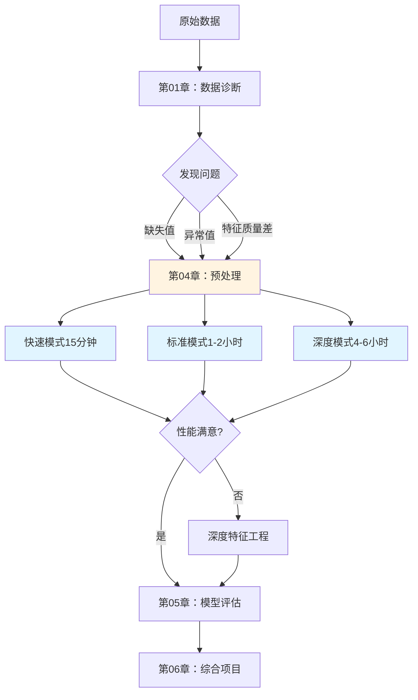

# 📐 第4章：数据预处理与特征工程

> **核心理念**："Garbage In, Garbage Out" - 数据质量决定模型上限
>
> **学习目标**：掌握系统化的数据预处理和特征工程方法，快速建立可用Baseline

---

## 🎯 章节简介

数据预处理和特征工程是机器学习项目的**关键环节**，虽然不如模型算法"性感"，但却决定了项目的成败。

**为什么重要？**
- 📊 占据80%的工作量，决定模型性能上限
- 🚀 良好的预处理可提升10-30%性能
- ⚠️ 错误的预处理会导致数据泄漏、过拟合等严重问题

**本章定位**：
- **不是教学文档**：不会详细讲解每个算法原理（那需要几百页）
- **是决策工具**：帮你快速决策"用什么方法处理这个问题"
- **是参考手册**：提供完整的决策矩阵和代码指向

---

## 📂 章节内容

本章包含**7个核心文档**，覆盖预处理和特征工程的完整流程：

| 文档 | 定位 | 适用场景 | 阅读时间 |
|------|------|---------|---------|
| [preprocessing_quick_reference.md](preprocessing_quick_reference.md)⭐ | 15分钟速查表 | 快速Baseline、时间紧急 | 15分钟 |
| [preprocessing_decision_tree.md](preprocessing_decision_tree.md)⭐ | 系统化决策流程 | 重要项目、生产环境 | 1-2小时 |
| [preprocessing_checklist.md](preprocessing_checklist.md)⭐ | 预处理检查清单 | 自检、代码审查 | 10-30分钟 |
| [missing_values_strategies.md](missing_values_strategies.md) | 缺失值完整指南 | 深入学习缺失值处理 | 1-1.5小时 |
| [outlier_detection_methods.md](outlier_detection_methods.md) | 异常值检测方法 | 深入学习异常值处理 | 0.5-1小时 |
| [feature_engineering_cookbook.md](feature_engineering_cookbook.md) | 特征工程食谱 | 深入学习特征工程 | 2-3小时 |
| **本README** | 总览与导航 | 首次了解章节结构 | 10分钟 |

---

## 🗺️ 三种使用模式

根据你的时间和项目需求，选择合适的使用模式：

### 模式1：快速模式（15-20分钟）⚡

**适合**：快速Baseline建立、时间紧急的项目、Kaggle快速实验

**路径**：
```
README.md（3分钟）
  └─ 了解章节结构
     ↓
preprocessing_quick_reference.md（15分钟）⭐
  └─ 5步快速预处理流程
  └─ 查决策表，执行代码
     ↓
进入建模阶段
```

**产出**：可用的Baseline数据

---

### 模式2：标准模式（1-2小时）📊

**适合**：正式项目、需要系统化处理、团队协作

**路径**：
```
README.md（3分钟）
  └─ 了解章节结构
     ↓
preprocessing_decision_tree.md（1-1.5小时）⭐
  └─ 10步系统化决策流程
  └─ 每步查阅详细文档
     ├─ missing_values_strategies.md（按需）
     ├─ outlier_detection_methods.md（按需）
     └─ feature_engineering_cookbook.md（按需）
     ↓
preprocessing_checklist.md（15分钟）⭐
  └─ 完整版检查清单验证
     ↓
生成预处理报告，进入建模阶段
```

**产出**：系统化处理的数据 + 完整文档

---

### 模式3：深度学习模式（4-6小时）📚

**适合**：首次系统学习、重要生产项目、需要深入理解

**路径**：
```
README.md（10分钟）
  └─ 完整阅读，理解全局
     ↓
专题学习（3-5小时）
  ├─ missing_values_strategies.md（1-1.5小时）
  │   └─ 理解MCAR/MAR/MNAR，掌握决策矩阵
  ├─ outlier_detection_methods.md（0.5-1小时）
  │   └─ 掌握检测方法和处理策略
  └─ feature_engineering_cookbook.md（2-3小时）⭐
      └─ 掌握完整特征工程流程
     ↓
实战练习（1小时）
  └─ preprocessing_decision_tree.md（系统化实践）
  └─ preprocessing_checklist.md（验证）
     ↓
查看代码实现
  ├─ src/data_preprocessing.py（654行）
  └─ src/feature_engineering.py（639行）
```

**产出**：完整的预处理知识体系

---

## 🚀 快速开始（3分钟）

### 场景1：我拿到新数据，想快速建立Baseline

```
1. 直接跳转 → preprocessing_quick_reference.md
2. 按5步流程执行（15分钟）
3. 完成预处理，进入建模
```

---

### 场景2：我的数据有大量缺失值/异常值，不知道怎么处理

```
问题类型判断：
├─ 缺失值问题 → missing_values_strategies.md
│   └─ 查"决策矩阵速查表"（第5节）
│   └─ 找到：缺失率 + 缺失机制 → 推荐方案
│
└─ 异常值问题 → outlier_detection_methods.md
    └─ 查"决策流程图"（第5节）
    └─ 找到：异常值性质 → 处理策略
```

---

### 场景3：我想系统化地完成预处理，确保不遗漏

```
1. preprocessing_decision_tree.md（1-2小时）
   └─ 按10步流程系统化执行

2. preprocessing_checklist.md（15分钟）
   └─ 完整版检查清单验证

3. 生成预处理记录卡（项目文档）
```

---

### 场景4：我想深入学习特征工程

```
1. feature_engineering_cookbook.md（2-3小时）
   └─ 完整阅读，理解3层特征工程

2. preprocessing_decision_tree.md（实践）
   └─ Step 8: 特征工程部分

3. 查看代码实现
   └─ src/feature_engineering.py
```

---

## 📊 预处理全景图



---

## 💡 核心概念速览

### 数据预处理的4大任务

#### 1. 缺失值处理⭐

**常见决策矩阵**：

| 缺失率 | 缺失机制 | 推荐方案 | 代码位置 |
|--------|---------|---------|----------|
| <5% | MCAR | 删除行 | `df.dropna()` |
| 5-20% | MCAR | 均值/中位数 | `data_preprocessing.py:166` |
| 5-20% | MAR | KNN填充 | `KNNImputer` |
| 20-50% | MAR | 迭代填充 | `IterativeImputer` |
| >50% | 任意 | 删除列 | `df.drop(columns)` |

**详见**：[missing_values_strategies.md](missing_values_strategies.md)

---

#### 2. 异常值处理

**快速决策**：

| 异常值性质 | 推荐方法 | 代码位置 |
|-----------|---------|----------|
| 数据错误 | 删除 | `data_preprocessing.py:234` |
| 真实极值+线性模型 | 鲁棒标准化 | `data_preprocessing.py:413` |
| 真实极值+树模型 | 保留 | - |

**详见**：[outlier_detection_methods.md](outlier_detection_methods.md)

---

#### 3. 特征编码

**快速决策**：

| 特征类型 | 基数 | 推荐编码 | 适用算法 |
|---------|------|---------|---------|
| 无序分类 | <10 | One-Hot | 线性模型、NN |
| 无序分类 | >10 | Target | 树模型 |
| 有序分类 | 任意 | Label | 树模型 |

---

#### 4. 特征工程⭐

**三个层次**：

```
Level 1: 特征选择（减少冗余）
├─ 方差过滤
├─ 相关性过滤
└─ 特征重要性排序

Level 2: 特征变换（改变分布）
├─ 标准化/归一化
├─ log/Box-Cox变换
└─ 编码方法

Level 3: 特征构造（创造新特征）⭐
├─ 时间特征提取
├─ 交互特征（乘除）
├─ 聚合特征（分组统计）
└─ 缺失值标记
```

**详见**：[feature_engineering_cookbook.md](feature_engineering_cookbook.md)

---

## 🔗 与项目其他部分的关联

### 输入：来自前置章节

```
第01章：数据诊断框架
  ↓ 识别数据问题
【缺失值、异常值、分布问题】
  ↓
第02章：问题定义指南
  ↓ 明确问题类型和目标
【分类/回归、平衡性、评估指标】
  ↓
第03章：算法选择矩阵
  ↓ 初步选定候选算法
【线性模型/树模型/NN → 决定预处理方式】
  ↓
━━━━━━━━━━━━━━━━━━━━━━━━━
第04章：预处理与特征工程（本章）
━━━━━━━━━━━━━━━━━━━━━━━━━
```

### 输出：进入后续章节

```
━━━━━━━━━━━━━━━━━━━━━━━━━
第04章：预处理与特征工程（本章）
━━━━━━━━━━━━━━━━━━━━━━━━━
  ↓ 产出：干净的、工程化的数据
【无缺失值、已编码、已缩放、特征丰富】
  ↓
第05章：模型评估
  ↓ 验证预处理效果
【对比不同预处理方案的性能】
  ↓
第06章：综合项目
  ↓ 完整流程实战
【Phase 2-3应用预处理】
```

---

## 🛠️ 代码实现速查

本章的理论方法已在代码中实现，可直接使用：

### src/data_preprocessing.py（654行）

**核心类和函数**：

| 功能 | 类/函数 | 行号范围 | 对应文档 |
|------|--------|---------|----------|
| 缺失值处理 | `MissingValueHandler` | 35-128 | missing_values_strategies.md |
| 缺失值处理 | `handle_missing_values()` | 130-188 | 同上 |
| 异常值处理 | `handle_outliers_iqr()` | 193-243 | outlier_detection_methods.md |
| 特征编码 | `CategoricalEncoder` | 248-353 | feature_engineering_cookbook.md |
| 特征编码 | `encode_categorical_features()` | 356-386 | 同上 |
| 特征缩放 | `FeatureScaler` | 391-459 | 同上 |
| 数据平衡 | `balance_data()` | 464-514 | 同上 |
| Pipeline构建 | `build_preprocessing_pipeline()` | 576-615 | 同上 |

**快速使用**：
```python
from src.data_preprocessing import *

# 1. 缺失值
df = handle_missing_values(df, numeric_strategy='median')

# 2. 异常值
df = handle_outliers_iqr(df, columns=['income'], method='clip')

# 3. 编码
df = encode_categorical_features(df, columns=['gender'], method='onehot')

# 4. 缩放
scaler = FeatureScaler(method='standard')
df = scaler.fit_transform(df)
```

---

### src/feature_engineering.py（639行）

**核心函数**：

| 功能 | 函数 | 行号范围 | 对应文档 |
|------|------|---------|----------|
| 方差过滤 | `select_by_variance()` | 34-70 | feature_engineering_cookbook.md |
| 相关性过滤 | `select_by_correlation()` | 73-114 | 同上 |
| 特征重要性 | `select_by_importance()` | 117-156 | 同上 |
| 多项式特征 | `create_polynomial_features()` | 211-247 | 同上 |
| log变换 | `apply_log_transform()` | 250-280 | 同上 |
| 分箱离散化 | `create_binned_features()` | 319-358 | 同上 |
| 交互特征 | `create_interaction_features()` | 363-408 | 同上 |
| 聚合特征 | `create_aggregation_features()` | 411-442 | 同上 |
| PCA特征 | `extract_pca_features()` | 447-485 | 同上 |
| 时间特征 | `extract_datetime_features()` | 525-560 | 同上 |

**快速使用**：
```python
from src.feature_engineering import *

# 1. 时间特征
df = extract_datetime_features(df, datetime_column='signup_date')

# 2. 交互特征
df = create_interaction_features(df, columns=['age', 'income'], operations=['*'])

# 3. 特征选择
df = select_by_correlation(df, threshold=0.95)
```

---

## 📋 学习检查清单

### 理论理解

完成本章学习后，你应该能够：

- [ ] 理解**MCAR/MAR/MNAR**三种缺失机制
- [ ] 掌握缺失值处理的**决策矩阵**
- [ ] 理解异常值的三种类型（数据错误、真实极值、潜在异常）
- [ ] 掌握不同编码方式的适用场景
- [ ] 理解特征工程的**三个层次**（选择、变换、构造）
- [ ] 掌握算法类型与预处理方式的对应关系

### 实践能力

- [ ] 能在15分钟内完成快速预处理
- [ ] 能使用决策树系统化执行预处理
- [ ] 能使用`src/data_preprocessing.py`处理缺失值和异常值
- [ ] 能使用`src/feature_engineering.py`进行特征工程
- [ ] 能创建**至少3个有意义的交互特征**
- [ ] 能编写完整的预处理Pipeline

### 决策能力

- [ ] 遇到新数据集，能快速判断需要哪些预处理步骤
- [ ] 能根据**算法类型**选择合适的预处理方法
- [ ] 能权衡**简单方法 vs 复杂方法**（成本收益）
- [ ] 能识别和避免**数据泄漏**问题

---

## 💬 常见问题 (FAQ)

### Q1: 快速模式和标准模式有什么区别？

**快速模式（15分钟）**：
- 使用简单可靠的方法（中位数填充、IQR截断）
- 适合快速Baseline建立
- 参考：[preprocessing_quick_reference.md](preprocessing_quick_reference.md)

**标准模式（1-2小时）**：
- 使用系统化决策流程（判断缺失机制、异常值性质）
- 适合正式项目
- 参考：[preprocessing_decision_tree.md](preprocessing_decision_tree.md)

### Q2: 缺失值一定要处理吗？

**取决于算法**：
- ✅ **必须处理**：线性模型、SVM、神经网络
- ⚠️ **建议处理**：KNN、朴素贝叶斯
- ⏭️ **可以跳过**：XGBoost、LightGBM（原生支持）

### Q3: 标准化和归一化选哪个？

| 方法 | 何时使用 | 适用算法 |
|------|---------|---------|
| **StandardScaler** | 正态分布、需要保留异常值信息 | 线性回归、SVM、PCA |
| **MinMaxScaler** | 有明确边界、不关心异常值 | 神经网络、KNN |
| **RobustScaler** | 有异常值、偏态分布 | 线性回归（鲁棒版本） |

### Q4: 特征工程能提升多少性能？

**根据经验**：
- 基础预处理（缺失值+标准化）：+5-10%
- 系统化特征工程（交互特征+领域特征）：+10-20%
- 深度特征工程（自动特征生成）：+20-30%

**注意**：收益递减，过度工程会导致过拟合

### Q5: 什么时候应该删除特征？

**以下情况考虑删除**：
- ✅ 缺失值>50%（信息太少）
- ✅ 方差接近0（几乎全是同一个值）
- ✅ 与其他特征高度相关（r>0.95，冗余）
- ✅ 特征重要性为0（对模型无贡献）
- ✅ 数据泄漏特征（如未来信息）

### Q6: 如何避免数据泄漏？

**关键原则**：
1. **训练集/测试集分割后再预处理**
2. **训练集fit，测试集transform**
3. **不使用目标变量进行特征工程**（Target编码需要交叉验证）
4. **不使用未来信息**（时间序列）

**使用Pipeline自动处理**：
```python
from sklearn.pipeline import Pipeline

pipeline = Pipeline([
    ('imputer', SimpleImputer()),
    ('scaler', StandardScaler()),
    ('model', LogisticRegression())
])

pipeline.fit(X_train, y_train)  # 只在训练集上fit
y_pred = pipeline.predict(X_test)  # 测试集只transform
```

---

## 🎓 推荐学习路径

### 第1次学习（完整理解，4-6小时）

**Day 1：数据质量处理（2-3小时）**
1. 阅读 `missing_values_strategies.md`（1-1.5h）
2. 阅读 `outlier_detection_methods.md`（0.5-1h）
3. 查看 `src/data_preprocessing.py` 对应函数（0.5h）

**Day 2：特征工程（2-3小时）**
1. 阅读 `feature_engineering_cookbook.md` 前半部分（1-1.5h）
   - 特征选择
   - 特征变换
2. 阅读 `feature_engineering_cookbook.md` 后半部分（1-1.5h）
   - 特征构造
   - 特定类型特征

**Day 3：系统化实践（1小时）**
1. 使用 `preprocessing_decision_tree.md` 系统化执行（45min）
2. 使用 `preprocessing_checklist.md` 验证（15min）

---

### 日常使用（快速查询，15-30分钟）

**场景驱动查询**：
- 需要快速处理 → `preprocessing_quick_reference.md`
- 需要系统化处理 → `preprocessing_decision_tree.md`
- 缺失值问题 → `missing_values_strategies.md`第5节决策矩阵
- 异常值问题 → `outlier_detection_methods.md`第5节决策流程
- 特征工程 → `feature_engineering_cookbook.md`第7节决策矩阵

---

## 📚 延伸阅读

### 本项目相关

- [ML_WORKFLOW_GUIDE.md](../ML_WORKFLOW_GUIDE.md) - 完整ML工作流
- [第01章：数据诊断框架](../01_data_diagnosis_framework/) - 识别数据问题
- [第03章：算法选择矩阵](../03_algorithm_selection_matrix/) - 算法与预处理的对应
- [第05章：模型评估](../05_model_evaluation/) - 验证预处理效果

### 外部资源

**书籍**：
- 《Feature Engineering for Machine Learning》- Alice Zheng & Amanda Casari
- 《Python特征工程实战》
- 《Hands-On Machine Learning》- Ch4: Training Models

**在线课程**：
- Kaggle Learn: Feature Engineering
- Coursera: Feature Engineering (deeplearning.ai)

**工具**：
- scikit-learn: 数据预处理和特征工程的标准库
- feature-engine: 专门的特征工程库
- featuretools: 自动特征工程

---

## 🎯 快速导航

### 按问题类型查找

| 问题类型 | 推荐文档 | 章节 |
|---------|---------|------|
| **大量缺失值** | missing_values_strategies.md | 第2-5节 |
| **异常值或极端值** | outlier_detection_methods.md | 第2-4节 |
| **不知道如何编码** | feature_engineering_cookbook.md | 第3.3节 |
| **不知道如何缩放** | feature_engineering_cookbook.md | 第3.1节 |
| **想提升性能** | feature_engineering_cookbook.md | 第4节（特征构造） |
| **时间紧急** | preprocessing_quick_reference.md | 全文 |
| **系统化处理** | preprocessing_decision_tree.md | 全文 |

### 按数据特征查找

| 数据特征 | 推荐方案 | 文档位置 |
|---------|---------|----------|
| **高维数据（>100列）** | 特征选择 | feature_engineering_cookbook.md 第2节 |
| **偏态分布** | log变换 | feature_engineering_cookbook.md 第3.1节 |
| **高基数分类特征** | Target编码 | feature_engineering_cookbook.md 第3.3节 |
| **时间序列数据** | 时间特征提取 | feature_engineering_cookbook.md 第5.1节 |
| **不平衡数据** | 数据平衡 | preprocessing_decision_tree.md Step 9 |

---

**最后更新**：2024年11月
**总学习时间**：
- 快速模式：15-20分钟
- 标准模式：1-2小时
- 深度学习：4-6小时

**下一章**：[第05章：模型评估](../05_model_evaluation/)
