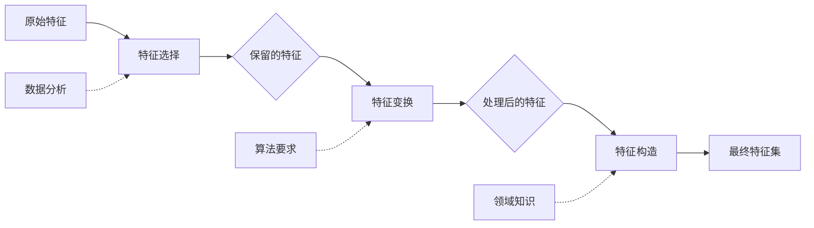

# 特征工程完整指南（食谱式）⭐

> **核心理念**："特征决定模型上限，算法只是逼近上限"
>
> **学习目标**：掌握系统化的特征工程方法，从特征选择、变换到构造的完整流程

---

## 📋 目录

1. [特征工程概述](#1-特征工程概述)
2. [第一部分：特征选择](#2-第一部分特征选择)
3. [第二部分：特征变换](#3-第二部分特征变换)
4. [第三部分：特征构造](#4-第三部分特征构造)
5. [第四部分：特定类型特征](#5-第四部分特定类型特征)
6. [特征工程检查清单](#6-特征工程检查清单)
7. [决策矩阵速查表](#7-决策矩阵速查表)
8. [代码示例](#8-代码示例)
9. [实战案例](#9-实战案例)

---

## 1. 特征工程概述

### 1.1 什么是特征工程

**定义**：使用领域知识和技术手段，从原始数据中提取、创造、选择特征的过程

**特征工程的三个层次**：

```
Level 1: 特征选择（Feature Selection）
目标：减少冗余，去除无关特征
方法：过滤法、包裹法、嵌入法

Level 2: 特征变换（Feature Transformation）
目标：改变特征分布，让算法更容易学习
方法：标准化、归一化、分箱、编码

Level 3: 特征构造（Feature Construction）⭐
目标：创造新特征，提升模型性能
方法：交互特征、聚合特征、降维特征
```

### 1.2 特征工程的价值

**实际案例的性能提升**：
- 基础预处理（标准化+编码）：+5-10%
- 系统化特征工程（交互+领域特征）：+10-20%
- 深度特征工程（自动特征生成）：+20-30%

**为什么有效**：
- ✅ 让非线性关系变线性（如log变换）
- ✅ 让算法"看到"领域知识（如时间特征）
- ✅ 降低维度，减少过拟合
- ✅ 处理偏态、异常值等数据问题

### 1.3 特征工程流程



---

## 2. 第一部分：特征选择

> **目标**：从N个特征中选择K个最有用的特征（K < N）

### 2.1 为什么需要特征选择

**问题**：
- 维度灾难：特征过多导致稀疏性
- 过拟合风险：噪声特征干扰模型
- 计算成本：训练时间随特征数增加
- 模型可解释性：特征越少越易解释

**收益**：
- 降低过拟合风险
- 缩短训练时间
- 提升模型性能
- 增强可解释性

### 2.2 过滤法（Filter Methods）

**原理**：根据特征与目标的统计关系评分，选择高分特征

#### 方法1：方差阈值（Variance Threshold）

**原理**：去除低方差特征（信息量少）

**适用场景**：
- 快速初筛
- 去除常数或准常数特征

**代码示例**：
```python
# TODO: 添加方差阈值代码
# 参考：src/feature_engineering.py 的 select_features(method='variance')
```

#### 方法2：相关系数（Correlation）

**原理**：
- 与目标高度相关的特征 → 保留
- 特征间高度相关 → 删除一个（去除冗余）

**阈值**：
- |r| > 0.7：高度相关
- |r| > 0.95：强冗余

**代码示例**：
```python
# TODO: 添加相关系数筛选代码
```

#### 方法3：卡方检验（Chi-Square Test）

**原理**：检验分类特征与目标的独立性

**适用场景**：
- 分类特征 + 分类目标
- 快速筛选

**代码示例**：
```python
# TODO: 添加卡方检验代码
from sklearn.feature_selection import chi2, SelectKBest
```

#### 方法4：互信息（Mutual Information）

**原理**：度量特征与目标的非线性关系

**优点**：
- 不假设线性关系
- 适用于非线性问题

**代码示例**：
```python
# TODO: 添加互信息代码
from sklearn.feature_selection import mutual_info_classif, mutual_info_regression
```

#### 方法5：F检验（F-test）

**原理**：检验数值特征与目标的线性关系

**适用场景**：
- 数值特征 + 连续目标（回归）
- 数值特征 + 分类目标（分类）

**代码示例**：
```python
# TODO: 添加F检验代码
from sklearn.feature_selection import f_classif, f_regression
```

### 2.3 包裹法（Wrapper Methods）

**原理**：用模型性能评估特征子集

#### 方法1：递归特征消除（RFE）⭐

**原理**：
1. 训练模型
2. 删除重要性最低的特征
3. 重复直到达到目标特征数

**优点**：
- 考虑特征间的交互
- 性能导向

**缺点**：
- 计算成本高（需要多次训练）
- 容易过拟合

**代码示例**：
```python
# TODO: 添加RFE代码
# 参考：src/feature_engineering.py 的 select_features(method='rfe')
from sklearn.feature_selection import RFE
```

#### 方法2：前向选择（Forward Selection）

**原理**：从空集开始，逐步添加最有用的特征

**代码示例**：
```python
# TODO: 添加前向选择代码
```

#### 方法3：后向消除（Backward Elimination）

**原理**：从全集开始，逐步删除最无用的特征

**代码示例**：
```python
# TODO: 添加后向消除代码
```

### 2.4 嵌入法（Embedded Methods）

**原理**：在模型训练过程中自动选择特征

#### 方法1：L1正则化（Lasso）⭐

**原理**：L1正则化使部分特征系数变为0

**优点**：
- 自动特征选择
- 防止过拟合

**适用场景**：
- 线性模型
- 高维稀疏数据

**代码示例**：
```python
# TODO: 添加L1正则化代码
# 参考：src/feature_engineering.py 的 select_features(method='lasso')
from sklearn.linear_model import LassoCV
```

#### 方法2：树模型特征重要性⭐

**原理**：基于信息增益或基尼指数计算特征重要性

**优点**：
- 快速
- 考虑非线性关系
- 考虑特征交互

**适用场景**：
- 树模型（RandomForest、XGBoost、LightGBM）
- 快速筛选

**代码示例**：
```python
# TODO: 添加树模型特征重要性代码
# 参考：src/feature_engineering.py 的 select_features(method='tree')
```

### 2.5 特征选择决策矩阵

| 场景 | 推荐方法 | 原因 | 代码位置 |
|------|---------|------|----------|
| **初筛（快速）** | 方差阈值 + 相关系数 | 计算快 | `src/feature_engineering.py:select_features()` |
| **线性问题** | F检验 or L1正则化 | 检验线性关系 | 同上 |
| **非线性问题** | 互信息 or 树模型重要性 | 考虑非线性 | 同上 |
| **分类特征** | 卡方检验 | 适用分类 | 同上 |
| **高维数据** | L1正则化 | 自动压缩 | 同上 |
| **追求性能** | RFE + 交叉验证 | 性能最优 | 同上 |
| **计算受限** | 过滤法 | 快速 | 同上 |

---

## 3. 第二部分：特征变换

> **目标**：改变特征分布，让算法更容易学习

### 3.1 数值特征变换

#### 变换1：标准化（Standardization）⭐

**公式**：
```
X_scaled = (X - mean(X)) / std(X)
```

**结果**：均值0、方差1

**何时使用**：
- ✅ 正态分布或接近正态
- ✅ 需要保留异常值信息
- ✅ 算法：线性回归、逻辑回归、SVM、PCA、神经网络

**代码示例**：
```python
# TODO: 添加标准化代码
# 参考：src/data_preprocessing.py 的 scale_features(method='standard')
from sklearn.preprocessing import StandardScaler
```

#### 变换2：归一化（Normalization）

**公式**：
```
X_scaled = (X - min(X)) / (max(X) - min(X))
```

**结果**：范围[0,1]

**何时使用**：
- ✅ 有明确边界的数据
- ✅ 不关心异常值
- ✅ 算法：神经网络、KNN、图像处理

**代码示例**：
```python
# TODO: 添加归一化代码
from sklearn.preprocessing import MinMaxScaler
```

#### 变换3：鲁棒标准化（Robust Scaling）

**公式**：
```
X_scaled = (X - median(X)) / IQR(X)
```

**何时使用**：
- ✅ 数据有异常值
- ✅ 偏态分布
- ✅ 需要稳健处理

**代码示例**：
```python
# TODO: 添加鲁棒标准化代码
from sklearn.preprocessing import RobustScaler
```

#### 变换4：对数变换（Log Transformation）

**公式**：
```
X_transformed = log(X + 1)  # +1避免log(0)
```

**何时使用**：
- ✅ 右偏分布（收入、房价）
- ✅ 数据跨多个数量级
- ✅ 指数关系变线性

**代码示例**：
```python
# TODO: 添加对数变换代码
```

#### 变换5：Box-Cox变换

**原理**：自动找到最优λ参数进行幂变换

**公式**：
```
当λ ≠ 0: X_transformed = (X^λ - 1) / λ
当λ = 0: X_transformed = log(X)
```

**何时使用**：
- ✅ 需要变为正态分布
- ✅ 数据必须>0

**代码示例**：
```python
# TODO: 添加Box-Cox变换代码
from scipy.stats import boxcox
```

### 3.2 分箱离散化（Binning）

**目标**：将连续变量转换为离散变量

#### 方法1：等宽分箱（Equal Width）

**原理**：每个箱的宽度相等

**何时使用**：
- ✅ 数据均匀分布
- ✅ 简单快速

**代码示例**：
```python
# TODO: 添加等宽分箱代码
# 参考：src/feature_engineering.py 的 binning(strategy='uniform')
```

#### 方法2：等频分箱（Equal Frequency）

**原理**：每个箱的样本数相等

**何时使用**：
- ✅ 数据偏态分布
- ✅ 避免某些箱为空

**代码示例**：
```python
# TODO: 添加等频分箱代码
# 参考：src/feature_engineering.py 的 binning(strategy='quantile')
```

#### 方法3：决策树分箱⭐

**原理**：用决策树找最优分割点

**优点**：
- 考虑与目标的关系
- 自适应分箱

**代码示例**：
```python
# TODO: 添加决策树分箱代码
# 参考：src/feature_engineering.py 的 binning(strategy='kmeans')
```

### 3.3 分类特征编码

#### 编码1：One-Hot编码⭐

**原理**：每个类别变为一个二值特征

**何时使用**：
- ✅ 低基数分类特征（<10个类别）
- ✅ 无序分类
- ✅ 算法：线性模型、神经网络

**优点**：
- 保留所有信息
- 适用于无序分类

**缺点**：
- 高基数时维度爆炸
- 稀疏矩阵

**代码示例**：
```python
# TODO: 添加One-Hot编码代码
# 参考：src/data_preprocessing.py 的 encode_categorical(method='onehot')
from sklearn.preprocessing import OneHotEncoder
```

#### 编码2：Label编码

**原理**：每个类别映射为一个整数

**何时使用**：
- ✅ 有序分类特征（如学历：小学<中学<大学）
- ✅ 树模型（不受数值大小影响）

**注意**：
- ⚠️ 不适合无序分类+线性模型（会引入虚假顺序）

**代码示例**：
```python
# TODO: 添加Label编码代码
from sklearn.preprocessing import LabelEncoder
```

#### 编码3：Target编码（Mean Encoding）⭐

**原理**：用目标变量的均值替换类别

**公式**：
```
category_value = mean(target | category)
```

**何时使用**：
- ✅ 高基数分类特征（>10个类别）
- ✅ 类别与目标高度相关

**优点**：
- 降低维度
- 保留与目标的关系

**缺点**：
- 容易过拟合（需要正则化）
- 数据泄露风险

**代码示例**：
```python
# TODO: 添加Target编码代码
# 参考：src/data_preprocessing.py 的 encode_categorical(method='target')
```

#### 编码4：Frequency编码

**原理**：用类别出现频率替换类别

**何时使用**：
- ✅ 高基数分类特征
- ✅ 频率与目标相关

**代码示例**：
```python
# TODO: 添加Frequency编码代码
```

#### 编码5：Binary编码

**原理**：先Label编码，再转二进制

**优点**：
- 比One-Hot维度低
- 保留部分顺序信息

**何时使用**：
- ✅ 中等基数分类特征（10-100）
- ✅ 需要节省维度

**代码示例**：
```python
# TODO: 添加Binary编码代码
```

### 3.4 特征变换决策矩阵

| 数据类型 | 特征分布 | 推荐变换 | 备选方案 | 算法 | 代码位置 |
|---------|---------|---------|---------|------|----------|
| **数值-正态** | - | 标准化 | - | LR/SVM/NN | `src/data_preprocessing.py` |
| **数值-偏态** | 右偏 | log变换 | Box-Cox | LR/SVM | 同上 |
| **数值-异常值** | - | 鲁棒标准化 | log | LR/SVM | 同上 |
| **数值-有界** | [0,1] | 归一化 | - | NN/KNN | 同上 |
| **数值-转分类** | - | 等频分箱 | 决策树分箱 | 任意 | `src/feature_engineering.py` |
| **分类-低基数** | <10 | One-Hot | - | LR/NN | `src/data_preprocessing.py` |
| **分类-高基数** | >10 | Target编码 | Frequency | 任意 | 同上 |
| **分类-有序** | - | Label编码 | - | 树模型 | 同上 |

---

## 4. 第三部分：特征构造⭐

> **目标**：创造新特征，提升模型性能（最有价值的部分）

### 4.1 交互特征（Interaction Features）

**原理**：组合多个特征，捕捉非线性关系

#### 方法1：算术组合

**常见组合**：

| 组合类型 | 公式 | 业务含义示例 |
|---------|------|------------|
| **加法** | X1 + X2 | 总收入 = 工资 + 奖金 |
| **减法** | X1 - X2 | 利润 = 收入 - 成本 |
| **乘法** | X1 × X2 | 总费用 = 单价 × 数量 |
| **除法** | X1 / X2 | 单价 = 总价 / 数量 |
| **比例** | X1 / (X1+X2) | 收入占比 = 工资 / 总收入 |

**代码示例**：
```python
# TODO: 添加算术组合代码
# 参考：src/feature_engineering.py 的 create_interaction_features()
```

#### 方法2：多项式特征

**原理**：生成特征的幂次和交叉项

**公式**（degree=2）：
```
[X1, X2] → [1, X1, X2, X1², X2², X1×X2]
```

**何时使用**：
- ✅ 非线性关系
- ✅ 线性模型（让线性模型拟合非线性）

**注意**：
- ⚠️ 维度爆炸（n特征degree=2 → n(n+1)/2特征）
- ⚠️ 容易过拟合

**代码示例**：
```python
# TODO: 添加多项式特征代码
from sklearn.preprocessing import PolynomialFeatures
```

#### 方法3：领域知识特征

**示例**：

| 领域 | 原始特征 | 交互特征 | 业务意义 |
|------|---------|---------|---------|
| **电商** | 浏览次数、购买次数 | 转化率 = 购买/浏览 | 用户购买意愿 |
| **金融** | 收入、负债 | 负债比 = 负债/收入 | 还款能力 |
| **医疗** | 身高、体重 | BMI = 体重/身高² | 肥胖程度 |
| **客户流失** | 月费、入网月数 | 总费用 = 月费×月数 | 客户价值 |

### 4.2 聚合特征（Aggregate Features）

**原理**：对分组数据进行统计聚合

#### 常见聚合函数

| 聚合函数 | 含义 | 业务示例 |
|---------|------|---------|
| **count** | 计数 | 用户订单数 |
| **sum** | 求和 | 用户总消费额 |
| **mean** | 平均值 | 平均订单金额 |
| **std** | 标准差 | 消费波动性 |
| **min/max** | 最小/最大值 | 最高/最低消费 |
| **median** | 中位数 | 消费中位数 |
| **nunique** | 唯一值数量 | 购买的商品种类数 |

**代码示例**：
```python
# TODO: 添加聚合特征代码
# 参考：src/feature_engineering.py 的 create_aggregate_features()
```

#### 时间窗口特征

**原理**：在时间窗口内聚合

**示例**：
- 过去7天的平均消费
- 过去30天的登录次数
- 滑动平均（MA）

**代码示例**：
```python
# TODO: 添加时间窗口特征代码
```

### 4.3 降维特征

#### 方法1：PCA降维⭐

**原理**：线性降维，保留最大方差

**何时使用**：
- ✅ 高维数据（>100维）
- ✅ 特征高度相关
- ✅ 线性关系

**代码示例**：
```python
# TODO: 添加PCA代码
from sklearn.decomposition import PCA
```

#### 方法2：聚类标签作为特征

**原理**：用K-Means等聚类，聚类ID作为新特征

**何时使用**：
- ✅ 发现数据子群体
- ✅ 增强无监督特征

**代码示例**：
```python
# TODO: 添加聚类标签代码
```

#### 方法3：异常分数作为特征

**原理**：用Isolation Forest等计算异常分数

**代码示例**：
```python
# TODO: 添加异常分数代码
```

---

## 5. 第四部分：特定类型特征

### 5.1 时间特征⭐

**原始**：datetime类型（如'2024-01-15 14:30:00'）

**提取特征**：

| 特征类型 | 提取内容 | 业务意义 |
|---------|---------|---------|
| **基础** | 年/月/日/小时/分钟 | 季节性、趋势 |
| **星期** | 星期几（0-6） | 周末效应 |
| **季度** | 季度（1-4） | 季节性 |
| **月份** | 月份（1-12） | 月度周期 |
| **是否节假日** | 是/否 | 特殊日期效应 |
| **时间差** | 距今天数 | 时间衰减 |
| **周期性** | sin/cos编码 | 循环特征 |

**代码示例**：
```python
# TODO: 添加时间特征提取代码
# 参考：src/feature_engineering.py 的 extract_datetime_features()
```

**周期性编码**（重要）：
```python
# TODO: 添加周期性编码代码
# 将月份（1-12）编码为sin/cos，保留周期性
```

### 5.2 文本特征

#### 方法1：基础统计

**提取特征**：
- 文本长度
- 单词数
- 句子数
- 特殊字符数（!、?、@等）
- 大写字母比例
- 数字比例

**代码示例**：
```python
# TODO: 添加文本统计特征代码
```

#### 方法2：TF-IDF

**原理**：词频-逆文档频率

**何时使用**：
- ✅ 短文本分类（评论、标题）
- ✅ 关键词提取

**代码示例**：
```python
# TODO: 添加TF-IDF代码
from sklearn.feature_extraction.text import TfidfVectorizer
```

#### 方法3：词嵌入（Word Embeddings）

**方法**：
- Word2Vec
- GloVe
- FastText
- BERT embeddings

**代码示例**：
```python
# TODO: 添加词嵌入代码
```

### 5.3 地理特征

#### 提取特征

| 特征类型 | 提取方法 | 示例 |
|---------|---------|------|
| **距离** | Haversine公式 | 到市中心的距离 |
| **区域编码** | 邮编/行政区 | 所属区域 |
| **密度** | 周边POI数量 | 商圈密度 |
| **空间聚类** | DBSCAN | 地理聚类ID |

**代码示例**：
```python
# TODO: 添加地理特征代码
# Haversine距离计算
```

---

## 6. 特征工程检查清单⭐

**在完成特征工程前，逐项检查**：

### 基础处理
- [ ] 缺失值已处理（删除/填充）
- [ ] 异常值已检查（保留/删除/稳健处理）
- [ ] 重复样本已删除

### 特征变换
- [ ] 数值特征已标准化/归一化（根据算法选择）
- [ ] 偏态特征已进行log/Box-Cox变换
- [ ] 分类特征已编码（One-Hot/Label/Target）
- [ ] 高基数分类特征已降维处理

### 特征构造
- [ ] 创建交互特征（至少3个）
- [ ] 创建聚合特征（如有分组数据）
- [ ] 提取时间特征（如有datetime列）
- [ ] 提取文本特征（如有文本列）

### 特征选择
- [ ] 删除低方差特征（variance_threshold）
- [ ] 删除高度相关特征（corr > 0.95）
- [ ] 特征重要性排序（树模型/L1）
- [ ] 选择Top K特征或设置阈值

### 验证与保存
- [ ] 交叉验证评估特征工程效果
- [ ] 保存特征列表和变换参数
- [ ] 文档化特征含义和构造逻辑

---

## 7. 决策矩阵速查表⭐

### 7.1 按数据类型选择方法

| 数据类型 | 特征工程方法 | 优先级 | 代码位置 |
|---------|------------|--------|----------|
| **数值-正态分布** | 标准化（StandardScaler） | P0 | `src/data_preprocessing.py` |
| **数值-偏态分布** | log变换 → 标准化 | P0 | 同上 |
| **数值-有异常值** | 鲁棒标准化（RobustScaler） | P0 | 同上 |
| **数值-跨数量级** | log变换 | P1 | 同上 |
| **数值-连续变量** | 分箱（等频/决策树） | P1 | `src/feature_engineering.py` |
| **分类-低基数(<10)** | One-Hot编码 | P0 | `src/data_preprocessing.py` |
| **分类-高基数(>10)** | Target编码 | P0 | 同上 |
| **分类-有序** | Label编码 | P0 | 同上 |
| **时间（datetime）** | 提取年/月/日/星期/节假日 | P0 | `src/feature_engineering.py` |
| **文本** | TF-IDF或长度统计 | P1 | 同上 |
| **地理（经纬度）** | 距离计算或区域编码 | P1 | 同上 |
| **多特征** | 交互特征（乘除） | P1 | 同上 |
| **高维数据** | PCA降维 | P1 | 同上 |

### 7.2 按算法类型选择方法

| 算法类型 | 必须做 | 建议做 | 可选做 | 不需要 |
|---------|--------|--------|--------|--------|
| **线性模型** | 标准化、One-Hot编码 | 多项式特征 | 特征选择 | - |
| **树模型** | 分类编码（Label/Target） | - | 特征选择 | 标准化 |
| **SVM** | 标准化、One-Hot编码 | 特征选择 | 多项式特征 | - |
| **神经网络** | 归一化、One-Hot编码 | - | PCA降维 | - |
| **KNN** | 标准化 | 特征选择 | - | - |

---

## 8. 代码示例

### 8.1 使用src/模块进行特征工程

```python
# TODO: 添加完整代码示例
# 展示如何使用 src/feature_engineering.py 的所有功能
```

### 8.2 完整Pipeline示例

```python
# TODO: 添加sklearn Pipeline代码
# 展示如何串联所有特征工程步骤
```

---

## 9. 实战案例

### 案例1：Telco客户流失预测

**背景**：
- 数据集：7043行×21列
- 目标：预测客户流失

**特征工程方案**：

#### Step 1: 特征变换
```python
# TODO: 添加完整代码
```

#### Step 2: 特征构造
```python
# TODO: 添加交互特征代码
# 创造的新特征：
# 1. tenure_group: tenure分箱（0-1年、1-2年、2+年）
# 2. avg_monthly_charge: TotalCharges / tenure（月均消费）
# 3. service_count: 订阅服务数量
# 4. is_senior_single: SeniorCitizen × (Partner=='No')
```

#### Step 3: 特征选择
```python
# TODO: 添加特征选择代码
```

**结果对比**：
| 阶段 | AUC | 提升 |
|------|-----|------|
| Baseline（原始特征） | 0.85 | - |
| +特征变换 | 0.88 | +3% |
| +特征构造 | 0.92 | +7% |
| +特征选择 | 0.92 | 持平（但特征减少30%） |

---

## 📚 参考资源

- **书籍**：
  - 《Feature Engineering for Machine Learning》- Alice Zheng & Amanda Casari
  - 《Python Feature Engineering Cookbook》

- **工具**：
  - scikit-learn: 特征工程标准库
  - feature-engine: 专门的特征工程库
  - featuretools: 自动特征工程

- **本项目**：
  - `src/feature_engineering.py`: 特征工程完整实现（638行）
  - `src/data_preprocessing.py`: 预处理和编码（653行）
  - `src/visualization.py`: 特征分析可视化

---

## ✅ 学习检查清单

完成本文档学习后，你应该能够：

- [ ] 理解特征工程的三个层次（选择、变换、构造）
- [ ] 掌握至少3种特征选择方法
- [ ] 掌握数值/分类/时间特征的处理方法
- [ ] 能创建至少3个有意义的交互特征
- [ ] 使用决策矩阵快速选择方法
- [ ] 编写完整的特征工程Pipeline
- [ ] 对比特征工程前后的性能提升

---

**最后更新**：2024年11月
**预计学习时间**：2-3小时
**相关文档**：
- [README.md](README.md) - 章节概览
- [missing_values_strategies.md](missing_values_strategies.md) - 缺失值处理
- [outlier_detection_methods.md](outlier_detection_methods.md) - 异常值处理

<!-- TODO: 本文档需要填充以下内容：
1. 所有代码示例的完整实现
2. 实战案例的详细代码
3. 更多特征构造的创意示例
4. 特征重要性分析方法
5. 自动特征工程工具（featuretools）介绍
-->
