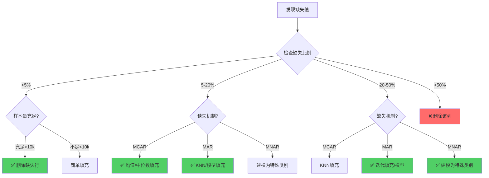

# 缺失值处理策略完整指南

> **核心原则**：理解缺失机制 → 选择合适策略 → 验证处理效果
>
> **学习目标**：掌握系统化的缺失值诊断和处理方法，避免盲目填充导致的偏差

---

## 📋 目录

1. [为什么缺失值是问题](#1-为什么缺失值是问题)
2. [第一步：诊断缺失值模式](#2-第一步诊断缺失值模式)
3. [第二步：选择处理方法](#3-第二步选择处理方法)
4. [第三步：验证处理效果](#4-第三步验证处理效果)
5. [决策矩阵速查表](#5-决策矩阵速查表)
6. [代码示例](#6-代码示例)
7. [常见陷阱与避免方法](#7-常见陷阱与避免方法)
8. [实战案例](#8-实战案例)

---

## 1. 为什么缺失值是问题

### 1.1 缺失值的影响

**对模型训练的影响**：
- ❌ 大多数算法无法处理缺失值（如线性回归、SVM、神经网络）
- ❌ 样本量减少（删除法）导致模型泛化能力下降
- ❌ 填充不当引入偏差，模型学到错误模式

**对统计分析的影响**：
- ❌ 统计量偏差（均值、方差估计不准确）
- ❌ 相关性分析失真
- ❌ 假设检验失效

### 1.2 缺失值的常见原因

| 原因类别 | 具体场景 | 示例 |
|---------|---------|------|
| **数据收集** | 传感器故障、网络中断 | IoT设备掉线导致数据缺失 |
| **用户行为** | 用户跳过问卷、隐私保护 | 收入信息未填写 |
| **数据整合** | 不同数据源字段不匹配 | 合并数据库时部分字段缺失 |
| **系统设计** | 非必填字段、条件显示 | 未婚用户的"配偶姓名"为空 |
| **数据错误** | 清洗时删除异常值 | 负数年龄被删除后变缺失 |

---

## 2. 第一步：诊断缺失值模式

### 2.1 缺失比例分析

**为什么重要**：缺失比例直接影响处理策略选择

**分析方法**：
```python
# 代码参考：src/data_diagnosis.py → check_missing()
missing_stats = df.isnull().sum()
missing_percent = (missing_stats / len(df)) * 100
```

**分类标准**：
- **轻度缺失**：<5% → 删除或简单填充
- **中度缺失**：5-20% → 高级填充方法
- **重度缺失**：20-50% → 建模填充或作为特殊类别
- **极重度缺失**：>50% → 考虑删除该特征

### 2.2 缺失机制识别⭐

**三种缺失机制**（Missing Mechanism）：

#### MCAR (Missing Completely At Random) - 完全随机缺失
**定义**：缺失与任何变量（观测值和缺失值）都无关

**特点**：
- ✅ 缺失是纯随机的（如设备随机故障）
- ✅ 缺失样本是总体的无偏代表
- ✅ 可以安全删除缺失样本

**判断方法**：
- 统计检验：Little's MCAR Test
- 可视化：缺失模式是否随机分布

**示例**：
- 温度传感器随机故障，导致部分时刻数据缺失
- 问卷随机丢失部分页面

#### MAR (Missing At Random) - 随机缺失
**定义**：缺失与观测值相关，但与缺失值本身无关

**特点**：
- ⚠️ 缺失依赖于其他已知变量
- ⚠️ 给定其他变量，缺失是随机的
- ⚠️ 可以通过其他变量预测缺失

**示例**：
- 年轻人更倾向于不填写收入（缺失依赖于年龄）
- 男性更可能跳过"怀孕史"（缺失依赖于性别）

**处理策略**：
- 基于其他变量的模型填充（KNN、回归）
- 多重插补（Multiple Imputation）

#### MNAR (Missing Not At Random) - 非随机缺失
**定义**：缺失与缺失值本身相关

**特点**：
- ❌ 缺失本身包含信息
- ❌ 最难处理的缺失类型
- ❌ 简单填充会引入严重偏差

**示例**：
- 高收入者不愿意填写收入（缺失值本身很高）
- 病情严重的患者更可能退出研究（缺失值本身极端）

**处理策略**：
- 建模为特殊类别（如"未填写"）
- 敏感性分析（不同假设下的结果）
- 收集更多信息（追踪原因）

### 2.3 缺失模式可视化

**可视化方法**：
1. **缺失值矩阵图**（Missing Matrix）- 查看缺失模式
2. **缺失值热力图**（Heatmap）- 查看缺失分布
3. **缺失值相关性图**（Correlation）- 查看特征间缺失关系

```python
# 代码参考：src/visualization.py → plot_missing_values()
import missingno as msno
msno.matrix(df)  # 缺失矩阵图
```

---

## 3. 第二步：选择处理方法

### 3.0 缺失值处理决策流程图⭐



**决策要点**：
- 🔴 **缺失>50%**：直接删除列（填充值会主导真实数据）
- 🟢 **缺失<5% + 样本充足**：删除缺失行最简单
- 🟢 **MAR机制**：用其他特征预测缺失值（KNN/迭代填充）
- 🟢 **MNAR机制**：缺失本身有意义，建模为特殊类别
- ⚠️ **时间序列**：使用前向/后向填充或插值

---

### 3.1 删除法（Deletion）

#### 列删除（Listwise Deletion）

**何时使用**：
- ✅ 缺失比例>50%
- ✅ 特征与目标相关性低
- ✅ MCAR机制

**优点**：
- 简单快速
- 不引入偏差（MCAR条件下）

**缺点**：
- 损失信息
- 样本量减少可能导致统计功效下降

#### 行删除（Pairwise Deletion）

**何时使用**：
- ✅ 缺失比例<5%
- ✅ MCAR机制
- ✅ 样本量充足（>10,000）

**优点/缺点**：
- ✅ 保留所有特征、不引入偏差
- ❌ 样本量减少、可能丢失重要样本

### 3.2 简单填充法（Simple Imputation）

**方法对比**：

| 方法 | 适用场景 | 优点 | 缺点 |
|------|---------|------|------|
| **均值填充** | 正态分布、MCAR | 简单、保持均值 | 低估方差 |
| **中位数填充** | 偏态分布、有异常值 | 稳健 | 低估方差 |
| **众数填充** | 分类特征 | 适用分类 | 增加峰度 |
| **常数填充** | MNAR、业务规则 | 保留缺失信息 | 需领域知识 |
| **前向/后向填充** | 时间序列 | 保持连续性 | 可能引入滞后 |

### 3.3 高级填充法（Advanced Imputation）

**KNN填充**：用K个最近邻样本的平均值填充
- ✅ 考虑样本相似性，比简单填充准确
- ❌ 计算成本高O(n²)，对数据缩放敏感

**迭代填充**：用其他特征预测缺失值（多次迭代）
- ✅ 最准确，适用MAR机制，保留特征关系
- ❌ 计算成本最高，可能过拟合

**模型填充**：训练预测模型（线性回归/逻辑回归/随机森林）
- ✅ 灵活，可自定义
- ❌ 需要额外建模工作

### 3.4 建模为特殊类别（MNAR）

**何时使用**：MNAR机制（缺失本身有意义）、分类特征、缺失比例5-30%

**方法**：
- 数值特征：添加缺失指示列（is_missing）
- 分类特征：新增"未知"类别

---

## 4. 第三步：验证处理效果

### 4.1 验证方法

**统计验证**：
- [ ] 填充后的分布是否合理？
- [ ] 填充值是否在合理范围内？
- [ ] 填充后的统计量（均值、方差）是否改变？

**模型验证**：
- [ ] 对比不同填充方法的模型性能
- [ ] 交叉验证评估稳定性

**可视化验证**：
- [ ] 填充前后的分布对比图
- [ ] 填充值与真实值的散点图（如有部分真实值）

### 4.2 对比实验

```python
# 对比不同填充方法的模型性能
# 详细实现见：src/data_preprocessing.py → compare_imputation_methods()
```

---

## 5. 决策矩阵速查表⭐

### 5.1 综合决策矩阵

| 缺失比例 | 缺失机制 | 推荐方法 | 备选方法 | 不推荐方法 | 代码位置 |
|---------|---------|---------|---------|----------|----------|
| <5% | MCAR | **删除行** | 均值/中位数 | 模型填充（过度） | `src/data_preprocessing.py:handle_missing()` |
| 5-20% | MCAR | **均值/中位数** | KNN | 删除 | 同上 |
| 5-20% | MAR | **KNN/模型填充** | 迭代填充 | 均值 | 同上 |
| 20-50% | MAR | **迭代填充** | 模型填充 | 删除 | 同上 |
| 20-50% | MNAR | **建模为特殊类别** | 常数填充 | 均值 | 同上 |
| >50% | 任意 | **删除列** | - | 填充 | 同上 |
| 时间序列 | - | **前向/后向填充** | 线性插值 | 均值 | 同上 |

### 5.2 按特征类型选择

| 特征类型 | 推荐方法 | 示例 |
|---------|---------|------|
| **数值-正态分布** | 均值填充 | 身高、体重 |
| **数值-偏态分布** | 中位数填充 | 收入、房价 |
| **数值-有异常值** | 中位数或KNN | 交易金额 |
| **分类-低基数** | 众数填充 | 性别、婚姻状况 |
| **分类-高基数** | 新增"未知"类别 | 城市、职业 |
| **时间序列** | 前向填充 | 股价、气温 |

### 5.3 按算法类型选择

| 算法类型 | 缺失值处理 | 原因 |
|---------|----------|------|
| **树模型**（RF、XGBoost） | 不处理或简单填充 | 原生支持缺失值 |
| **线性模型**（LR、Lasso） | 必须填充 | 不支持缺失值 |
| **SVM** | 必须填充 | 不支持缺失值 |
| **神经网络** | 必须填充 | 不支持缺失值 |
| **KNN** | 必须填充 | 基于距离计算 |

---

## 6. 代码示例

### 6.1 使用src/模块处理缺失值

```python
from src.data_preprocessing import handle_missing

# 方式1：删除缺失行（缺失<5%）
df_clean = handle_missing(df, strategy='drop', threshold=0.05)

# 方式2：中位数填充（数值特征）
df_filled = handle_missing(df, strategy='median', columns=['age', 'income'])

# 方式3：KNN填充（MAR机制）
df_knn = handle_missing(df, strategy='knn', n_neighbors=5)

# 详细实现见：src/data_preprocessing.py (653行)
```

### 6.2 使用sklearn处理缺失值

```python
from sklearn.impute import SimpleImputer, KNNImputer
from sklearn.pipeline import Pipeline

# 中位数填充
imputer = SimpleImputer(strategy='median')
X_filled = imputer.fit_transform(X_train)

# KNN填充
knn_imputer = KNNImputer(n_neighbors=5)
X_knn = knn_imputer.fit_transform(X_train)
```

---

## 7. 常见陷阱与避免方法

### 7.1 数据泄露⭐

**陷阱**：在训练集/测试集分割**前**计算统计量

```python
# ❌ 错误：数据泄露
df['age'].fillna(df['age'].mean())  # 用全量数据的均值
X_train, X_test = train_test_split(df)

# ✅ 正确：先分割再填充
X_train, X_test = train_test_split(df)
mean_age = X_train['age'].mean()  # 只用训练集的均值
X_train['age'].fillna(mean_age)
X_test['age'].fillna(mean_age)  # 测试集用训练集的统计量
```

### 7.2 低估方差

**陷阱**：均值填充导致方差变小

**影响**：
- 相关性分析偏高
- 置信区间过窄
- 假设检验失效

**避免**：
- 使用KNN或模型填充
- 多重插补（保留不确定性）

### 7.3 忽略缺失机制

**陷阱**：所有缺失值都用均值填充

**后果**：MNAR数据引入严重偏差

**避免**：先诊断缺失机制，再选择方法

### 7.4 过度填充

**陷阱**：缺失>50%仍然填充

**后果**：
- 填充值主导原始数据
- 模型学到的是填充规则，不是真实模式

**避免**：缺失>50%考虑删除特征

---

## 8. 实战案例

### 案例1：Telco客户流失数据

**背景**：
- 数据集：7043行×21列
- 缺失情况：TotalCharges列有11个缺失值（0.16%）
- 缺失机制：MCAR（随机缺失）

**处理方案决策**：
- **方案1**：删除11行（推荐✅）→ 缺失比例极低，删除不影响
- **方案2**：用 MonthlyCharges × tenure 计算填充
- **对比结果**：性能差异<0.1%，选择方案1（最简单）

### 案例2：房价预测数据

**背景**：
- 数据集：1460行×80列
- 缺失情况：多个特征缺失5-80%
- 问题：多种缺失机制混合

**处理策略**：
1. **删除**：缺失>50%的特征（如Alley、Fence）
2. **建模**：缺失5-20%且MAR的特征（如LotFrontage用回归填充）
3. **特殊类别**：缺失有意义的特征（如GarageType缺失="无车库"）

---

## 📚 参考资源

- **论文**：
  - Rubin, D.B. (1976). Inference and missing data. Biometrika.
  - Little, R.J.A. & Rubin, D.B. (2002). Statistical Analysis with Missing Data.

- **工具**：
  - scikit-learn: SimpleImputer, KNNImputer, IterativeImputer
  - missingno: 缺失值可视化
  - fancyimpute: 高级填充方法

- **本项目**：
  - `src/data_diagnosis.py`: check_missing()
  - `src/data_preprocessing.py`: handle_missing()
  - `src/visualization.py`: plot_missing_values()

---

## ✅ 学习检查清单

完成本文档学习后，你应该能够：

- [ ] 理解三种缺失机制（MCAR/MAR/MNAR）并能判断
- [ ] 根据缺失比例和机制选择合适的处理方法
- [ ] 使用决策矩阵快速决策
- [ ] 避免常见陷阱（数据泄露、低估方差）
- [ ] 对比不同填充方法的效果
- [ ] 使用src/模块处理缺失值

---

**最后更新**：2024年11月
**预计学习时间**：1-1.5小时
**相关文档**：
- [README.md](README.md) - 章节概览
- [outlier_detection_methods.md](outlier_detection_methods.md) - 异常值处理
- [feature_engineering_cookbook.md](feature_engineering_cookbook.md) - 特征工程

