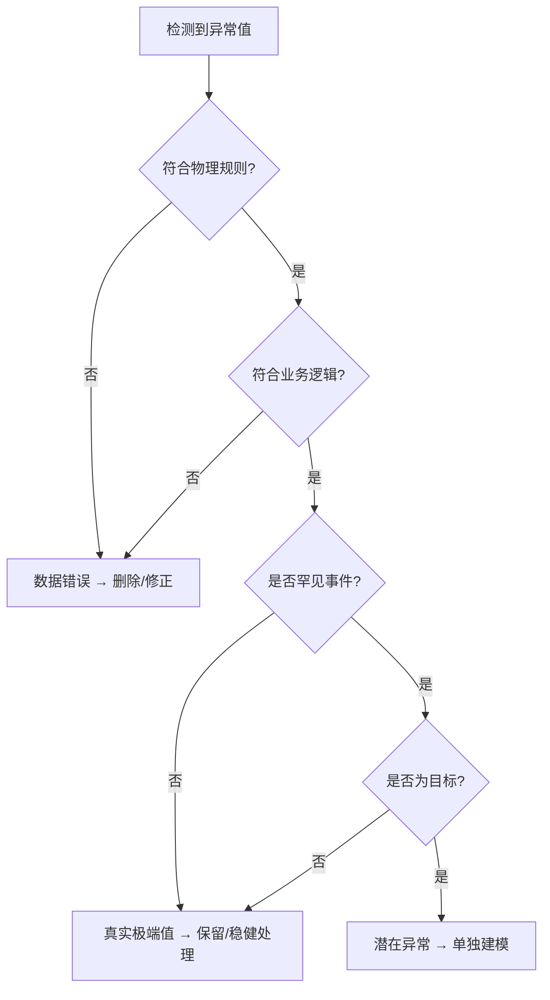
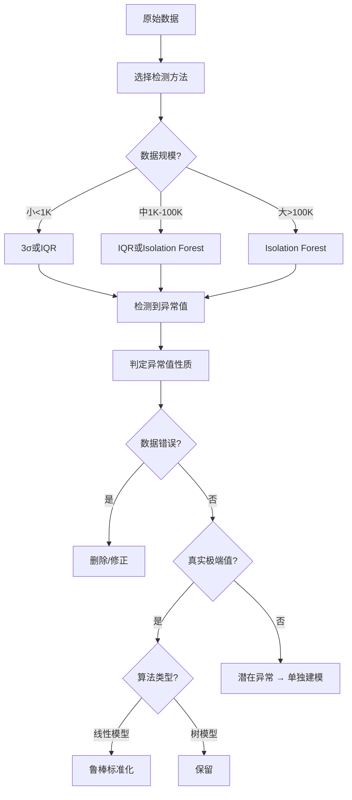

# 异常值检测与处理方法

> **核心原则**：检测异常值 → 判断性质 → 选择策略 → 验证效果
>
> **学习目标**：掌握统计和机器学习方法检测异常值，并根据业务判断选择合适的处理策略

---

## 📋 目录

1. [什么是异常值](#1-什么是异常值)
2. [第一步：检测异常值](#2-第一步检测异常值)
3. [第二步：判定异常值性质](#3-第二步判定异常值性质)
4. [第三步：选择处理策略](#4-第三步选择处理策略)
5. [决策流程图](#5-决策流程图)
6. [代码示例](#6-代码示例)
7. [实战案例](#7-实战案例)

---

## 1. 什么是异常值

### 1.1 定义

**异常值（Outlier）**：偏离数据整体分布的极端值

**为什么重要**：
- ✅ 可能是数据错误（需要修正或删除）
- ✅ 可能是真实极端值（包含重要信息）
- ✅ 可能是特殊事件（需要单独建模）

### 1.2 异常值的影响

**对统计分析**：
- ❌ 均值严重偏移（如收入中位数vs平均数）
- ❌ 标准差被放大
- ❌ 相关系数失真

**对机器学习模型**：
- ❌ **线性模型**：最小二乘法对异常值敏感
- ❌ **距离度量模型**：KNN、K-Means被异常值主导
- ⚠️ **树模型**：相对鲁棒，但仍可能过拟合异常值
- ✅ **稳健模型**：Huber回归、RANSAC对异常值鲁棒

### 1.3 异常值的类型

| 类型 | 定义 | 示例 |
|------|------|------|
| **单变量异常值** | 单个特征的极端值 | 年龄=150岁 |
| **多变量异常值** | 特征组合异常 | 年龄=10岁 + 职业=CEO |
| **时间序列异常值** | 时间维度的突变 | 股价突然暴涨10倍 |
| **聚类异常值** | 远离所有聚类中心 | 欺诈交易模式 |

---

## 2. 第一步：检测异常值

### 2.1 统计方法

#### 方法1：3σ原则（Three-Sigma Rule）

**原理**：正态分布下，99.7%的数据在均值±3σ范围内

**公式**：
```
异常值定义：|X - μ| > 3σ
其中：μ = 均值, σ = 标准差
```

**优点**：
- 简单直观
- 计算快速

**缺点**：
- 假设正态分布（实际数据常偏态）
- 对极端值敏感（均值和标准差都受异常值影响）

**适用场景**：
- 数据接近正态分布
- 样本量较大（>100）
- 快速初步筛查

**代码示例**：
```python
# 代码参考：src/data_preprocessing.py → detect_outliers()
mean, std = df['age'].mean(), df['age'].std()
outliers = df[abs(df['age'] - mean) > 3 * std]
```

#### 方法2：IQR方法（Interquartile Range）⭐推荐

**原理**：基于四分位数识别异常值

**公式**：
```
Q1 = 第25百分位数
Q3 = 第75百分位数
IQR = Q3 - Q1

异常值定义：
  下界：Q1 - 1.5 × IQR
  上界：Q3 + 1.5 × IQR
超出范围即为异常值
```

**优点**：
- **稳健**：不受异常值影响
- 适用于偏态分布
- 箱线图可视化

**缺点**：
- 固定阈值（1.5可能不适合所有场景）
- 只考虑单变量

**适用场景**：
- 偏态分布数据
- 需要稳健方法
- 数据可视化分析

**代码示例**：
```python
# 代码参考：src/data_preprocessing.py → detect_outliers(method='iqr')
Q1, Q3 = df['age'].quantile(0.25), df['age'].quantile(0.75)
IQR = Q3 - Q1
outliers = df[(df['age'] < Q1 - 1.5*IQR) | (df['age'] > Q3 + 1.5*IQR)]
```

#### 方法3：Z-Score标准化

**原理**：将数据标准化，检测偏离标准正态分布的值

**公式**：
```
Z = (X - μ) / σ

异常值定义：|Z| > 3
```

**优点**：
- 标准化后易于对比
- 适合多特征对比

**缺点**：
- 与3σ原则相同
- 假设正态分布

**代码示例**：
```python
# TODO: 添加Z-Score检测代码
```

#### 方法4：修正Z-Score（Modified Z-Score）

**原理**：用中位数和MAD（中位数绝对偏差）替代均值和标准差

**公式**：
```
MAD = median(|X - median(X)|)
Modified Z-Score = 0.6745 × (X - median(X)) / MAD

异常值定义：|Modified Z-Score| > 3.5
```

**优点**：
- **极其稳健**：中位数和MAD都不受异常值影响
- 适用于偏态分布

**缺点**：
- 计算稍复杂
- 阈值需要调整

**代码示例**：
```python
# TODO: 添加Modified Z-Score检测代码
```

### 2.2 机器学习方法

#### 方法5：Isolation Forest（孤立森林）⭐

**原理**：异常值更容易被孤立（需要更少的分割次数）

**优点**：
- ✅ **无监督**：不需要标签
- ✅ **多变量**：自动考虑特征组合
- ✅ **高效**：时间复杂度O(n log n)
- ✅ 适用于高维数据

**缺点**：
- 需要调参（contamination比例）
- 黑盒模型，可解释性差

**适用场景**：
- 高维数据
- 多变量异常检测
- 大规模数据

**代码示例**：
```python
# TODO: 添加Isolation Forest检测代码
# 参考：src/data_preprocessing.py 的 detect_outliers(method='isolation_forest')
```

#### 方法6：LOF（局部异常因子）

**原理**：基于局部密度检测异常值

**优点**：
- 考虑局部密度
- 适用于密度不均匀的数据
- 多变量检测

**缺点**：
- 计算成本高O(n²)
- 需要选择K值

**适用场景**：
- 密度不均匀数据
- 中小规模数据（<10,000）
- 聚类异常检测

**代码示例**：
```python
# TODO: 添加LOF检测代码
# 参考：src/data_preprocessing.py 的 detect_outliers(method='lof')
```

#### 方法7：One-Class SVM

**原理**：学习正常数据的边界，边界外为异常值

**优点**：
- 适用于非线性边界
- 核技巧处理高维

**缺点**：
- 计算成本高
- 参数敏感（nu、gamma）
- 可解释性差

**适用场景**：
- 非线性异常边界
- 中等规模数据

**代码示例**：
```python
# TODO: 添加One-Class SVM检测代码
```

### 2.3 领域特定方法

#### 时间序列异常检测

**方法**：
- 移动平均 + 残差分析
- ARIMA残差检测
- LSTM自编码器

**代码示例**：
```python
# TODO: 添加时间序列异常检测代码
```

#### 图像异常检测

**方法**：
- 自编码器重构误差
- GAN判别器
- 特征提取 + 聚类

---

## 3. 第二步：判定异常值性质

### 3.1 三类异常值

#### 类型1：数据错误⭐

**特征**：
- 物理上不可能（年龄200岁）
- 逻辑上矛盾（未婚但有配偶）
- 明显录入错误（小数点位置错误）

**判断方法**：
- 业务规则验证
- 逻辑一致性检查
- 与历史数据对比

**处理策略**：
- ✅ **删除**：无法修正时
- ✅ **修正**：可以推断正确值时
- ✅ **标记**：需要人工审核

**示例**：
```python
# TODO: 添加数据错误识别代码
```

#### 类型2：真实极端值

**特征**：
- 符合业务逻辑
- 可以追溯来源
- 重复出现的模式

**判断方法**：
- 业务专家验证
- 数据来源追溯
- 时间序列分析

**处理策略**：
- ✅ **保留**：包含重要信息
- ✅ **稳健处理**：使用鲁棒方法
- ⚠️ **不删除**：避免损失信息

**示例**：
- 亿万富翁的收入
- 黑色星期五的销售额
- 疫情期间的口罩需求

#### 类型3：潜在异常事件

**特征**：
- 符合逻辑但罕见
- 可能是欺诈、异常行为
- 需要特别关注

**判断方法**：
- 领域知识
- 历史模式对比
- 聚类分析

**处理策略**：
- ✅ **单独建模**：异常检测问题
- ✅ **标记**：作为特殊类别
- ⚠️ **不删除**：可能是目标

**示例**：
- 信用卡欺诈交易
- 网络入侵行为
- 设备故障前兆

### 3.2 判定流程图



---

## 4. 第三步：选择处理策略

### 4.1 删除策略

**何时删除**：
- ✅ 确认为数据错误
- ✅ 无法修正
- ✅ 占比极小（<0.5%）
- ✅ 对模型有严重负面影响

**如何删除**：
```python
# TODO: 添加删除异常值代码
```

**注意事项**：
- ⚠️ 记录删除原因和数量
- ⚠️ 不要删除真实极端值
- ⚠️ 删除前备份数据

### 4.2 修正策略

**何时修正**：
- ✅ 可以推断正确值（如小数点错误）
- ✅ 有参考值（如历史数据）
- ✅ 逻辑矛盾可修复

**修正方法**：
- 使用中位数/均值替代
- 用前后值插值
- 根据其他特征推断

**代码示例**：
```python
# TODO: 添加修正异常值代码
```

### 4.3 保留 + 稳健方法

**何时保留**：
- ✅ 真实极端值
- ✅ 包含重要信息
- ✅ 业务需要

**稳健方法**：

| 方法 | 原理 | 适用算法 |
|------|------|---------|
| **鲁棒标准化** | RobustScaler用中位数和IQR | 线性模型、SVM |
| **对数变换** | log(X+1)压缩极端值 | 偏态分布 |
| **截断** | Winsorize：用分位数替换极值 | 任意模型 |
| **稳健回归** | Huber Loss、RANSAC | 线性回归 |

**代码示例**：
```python
# TODO: 添加稳健方法代码
# 参考：src/data_preprocessing.py 的 handle_outliers()
```

### 4.4 单独建模策略

**何时单独建模**：
- ✅ 异常值是研究目标（欺诈检测）
- ✅ 异常值形成独立模式
- ✅ 占比适中（1-10%）

**方法**：
- 分层建模：正常样本一个模型，异常样本一个模型
- 集成方法：用异常检测器+分类器
- 加权学习：给异常样本更高权重

**代码示例**：
```python
# TODO: 添加单独建模代码
```

---

## 5. 决策流程图

### 5.1 完整决策流程



### 5.2 决策矩阵

| 异常值性质 | 推荐处理 | 备选方案 | 不推荐 | 代码位置 |
|-----------|---------|---------|--------|----------|
| **数据错误** | 删除 | 修正（如可推断） | 保留 | `src/data_preprocessing.py:handle_outliers()` |
| **真实极值+线性模型** | 鲁棒标准化 | 对数变换 | 删除 | 同上 |
| **真实极值+树模型** | 保留 | - | 删除 | 同上 |
| **潜在异常（占比<1%）** | 单独建模 | 删除 | 保留 | 同上 |
| **潜在异常（占比1-10%）** | 单独建模 | 分层建模 | 简单保留 | 同上 |

---

## 6. 代码示例

### 6.1 使用src/模块检测和处理异常值

```python
# TODO: 添加完整代码示例
# 展示如何使用 src/data_preprocessing.py 的功能
```

### 6.2 使用sklearn检测异常值

```python
# TODO: 添加sklearn代码示例
from sklearn.ensemble import IsolationForest
from sklearn.neighbors import LocalOutlierFactor
from sklearn.svm import OneClassSVM
```

### 6.3 可视化异常值

```python
# TODO: 添加可视化代码
# 参考：src/visualization.py 的 plot_boxplots()
```

---

## 7. 实战案例

### 案例1：Telco客户数据异常值处理

**背景**：
- 数据集：7043行×21列
- 异常值：MonthlyCharges有少量极端值

**检测**：
```python
# TODO: 添加检测代码
```

**判定**：
- 查看业务规则：MonthlyCharges范围18-119美元
- 判断：真实极端值（高端套餐用户）

**处理**：
- 保留（包含重要信息）
- 使用树模型（对异常值鲁棒）

### 案例2：房价预测异常值

**背景**：
- 数据集：房价数据
- 异常值：SalePrice有极高值（豪宅）

**检测**：
```python
# TODO: 添加检测代码
```

**判定**：真实极端值

**处理**：
- 对数变换：log(SalePrice)压缩分布
- 鲁棒标准化：特征标准化

---

## 📚 参考资源

- **书籍**：
  - 《Outlier Analysis》- Charu C. Aggarwal
  - 《Robust Statistics》- Peter J. Huber

- **工具**：
  - scikit-learn: IsolationForest, LocalOutlierFactor, OneClassSVM
  - PyOD: Python Outlier Detection库
  - statsmodels: 统计异常检测

- **本项目**：
  - `src/data_diagnosis.py`: detect_outliers()
  - `src/data_preprocessing.py`: handle_outliers()
  - `src/visualization.py`: plot_boxplots()

---

## ✅ 学习检查清单

完成本文档学习后，你应该能够：

- [ ] 理解异常值的三种类型（数据错误、真实极值、潜在异常）
- [ ] 掌握至少3种检测方法（3σ、IQR、Isolation Forest）
- [ ] 根据异常值性质选择合适的处理策略
- [ ] 使用决策流程图做系统化判断
- [ ] 对比不同处理策略的效果
- [ ] 使用src/模块检测和处理异常值

---

**最后更新**：2024年11月
**预计学习时间**：0.5-1小时
**相关文档**：
- [README.md](README.md) - 章节概览
- [missing_values_strategies.md](missing_values_strategies.md) - 缺失值处理
- [feature_engineering_cookbook.md](feature_engineering_cookbook.md) - 特征工程

<!-- TODO: 本文档需要填充以下内容：
1. 各检测方法的详细代码示例
2. 实战案例的完整代码
3. 更多可视化图表
4. 决策流程的详细说明
-->
