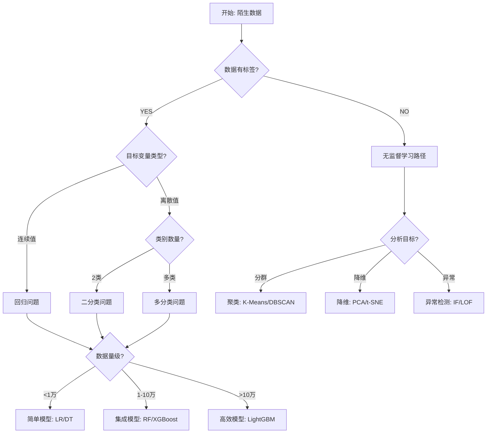
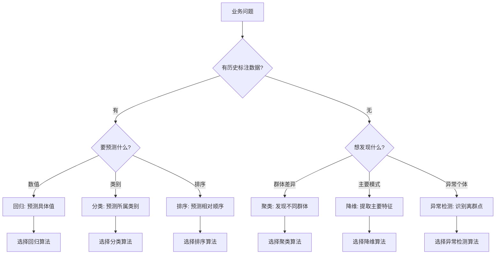
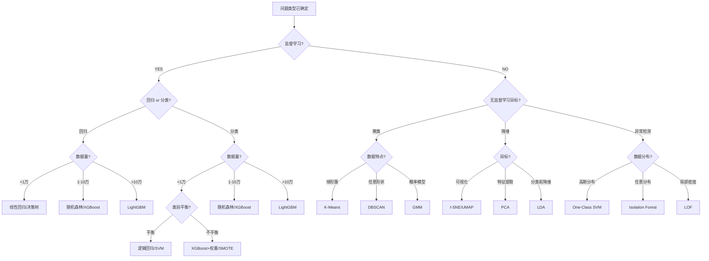
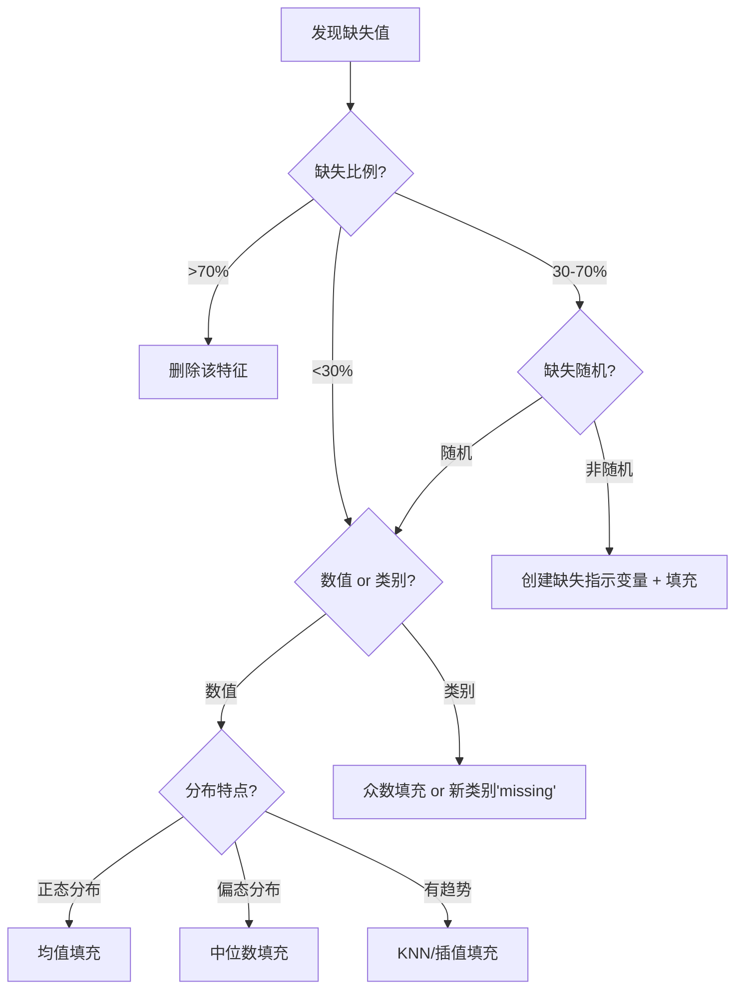
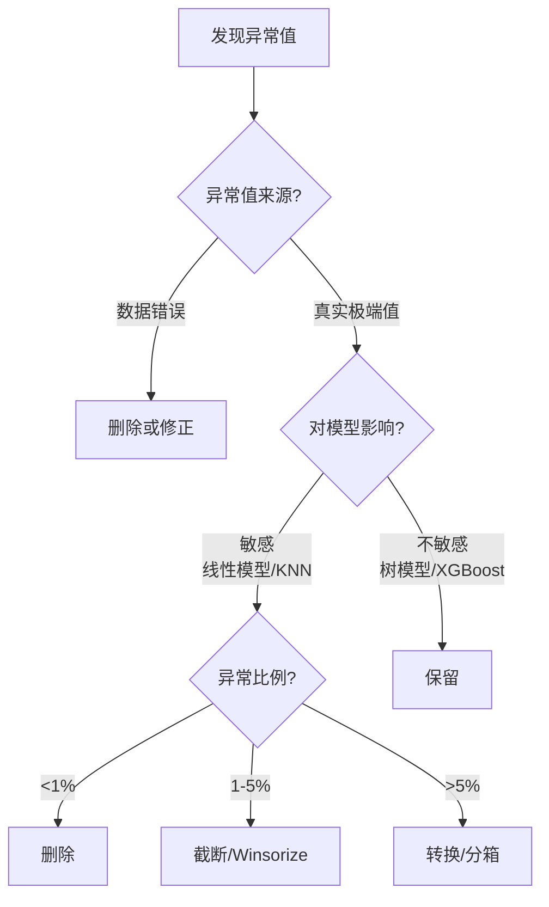
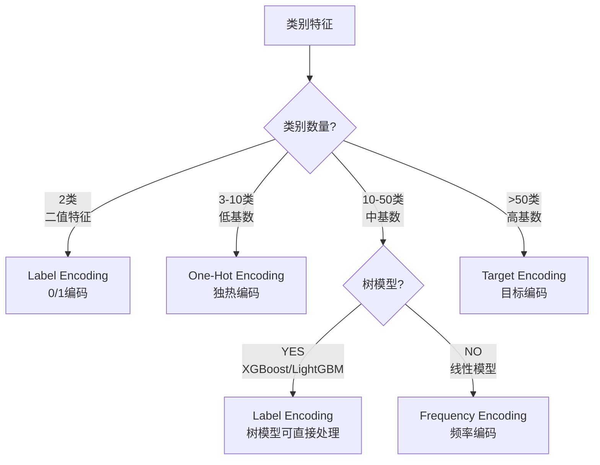
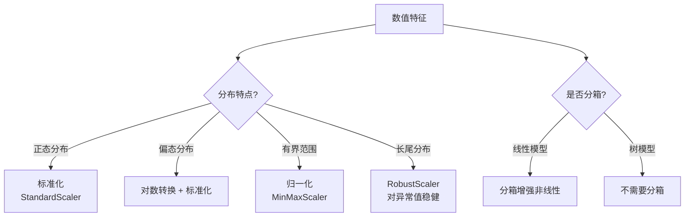
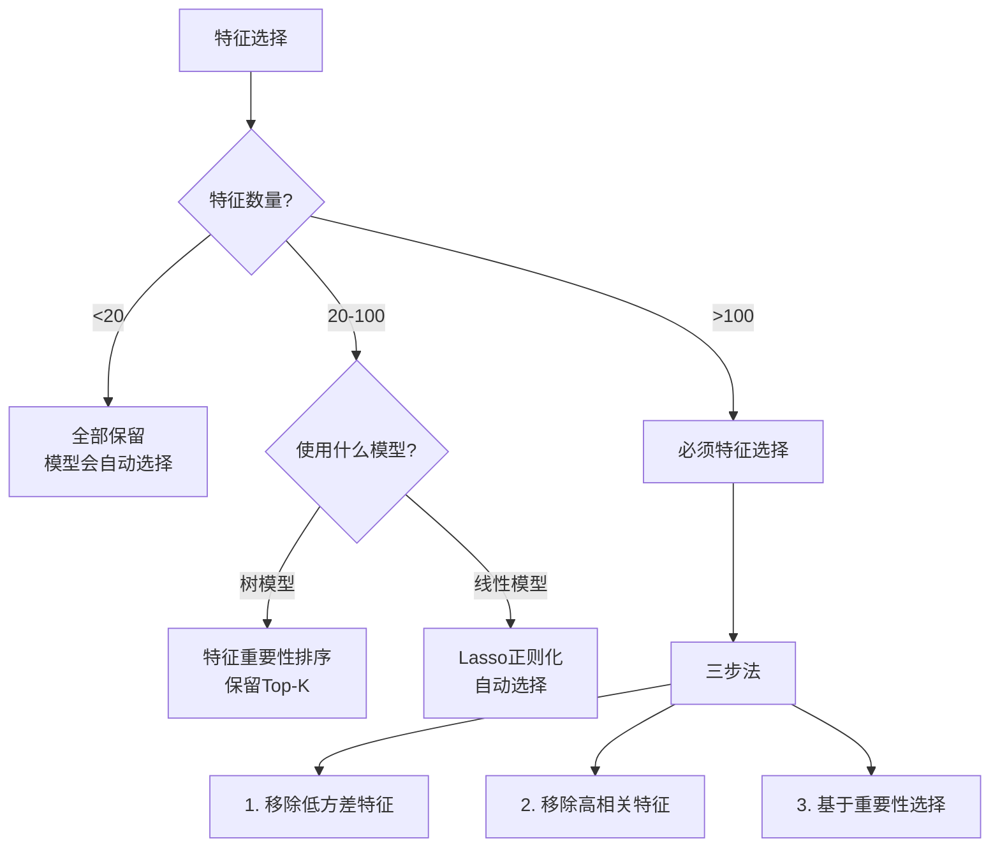
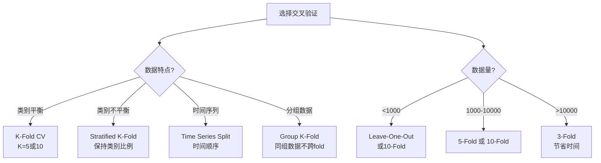
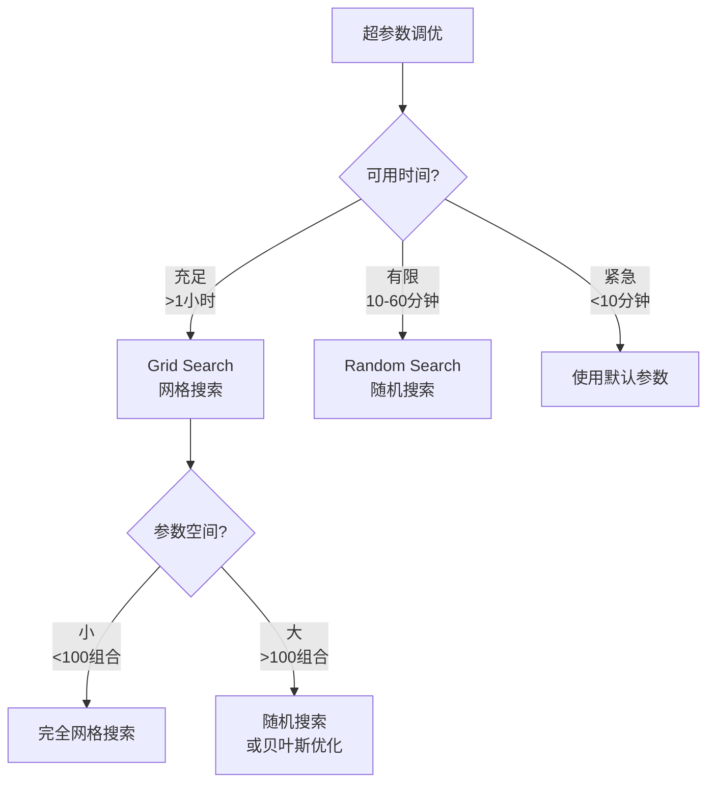

# 🧭 机器学习完整工作流程决策树

> **像医生诊断疾病一样诊断ML问题**
> 从陌生数据到最终方案的完整决策指南

---

## 📖 使用说明

### 本文档的定位

这是一份**实战导向的决策指南**，不是算法教科书。当你面对一个新的机器学习问题时，这份文档会像医生诊断疾病一样，引导你一步步做出正确的决策。

### 如何使用本文档

1. **首次学习**：从头到尾完整阅读一遍，理解整个决策流程
2. **实战参考**：面对新项目时，按照决策树逐步推进
3. **查漏补缺**：遇到困惑时，查找对应决策点的详细说明

### 文档结构

```
第一部分：数据诊断阶段 → 了解数据，识别问题
第二部分：问题定义阶段 → 确定目标，选择方向
第三部分：算法选择阶段 → 根据数据特点选择算法
第四部分：数据处理阶段 → 预处理和特征工程
第五部分：模型训练阶段 → 训练、调优、验证
第六部分：模型评估阶段 → 评估效果，业务转化
```

---

## 🎯 第一部分：数据诊断阶段

> **目标**：快速了解数据特点，识别潜在问题

### 1.1 数据诊断检查清单

#### ✅ 第一步：数据概览

```python
# 基本信息检查
import pandas as pd
df = pd.read_csv('data.csv')

# 1. 数据规模
print(f"数据规模: {df.shape[0]:,} 行 × {df.shape[1]} 列")
print(f"内存占用: {df.memory_usage(deep=True).sum() / 1024**2:.2f} MB")

# 2. 特征类型统计
print(f"数值特征: {df.select_dtypes(include=['int', 'float']).shape[1]} 个")
print(f"分类特征: {df.select_dtypes(include=['object', 'category']).shape[1]} 个")
print(f"日期特征: {df.select_dtypes(include=['datetime']).shape[1]} 个")
```

**诊断要点**：
- 数据量级：小(<1万) / 中(1-10万) / 大(>10万) / 海量(>100万)
- 特征数量：低维(<10) / 中维(10-50) / 高维(50-100) / 超高维(>100)
- 内存占用：是否需要优化数据类型或分块处理

---

#### ✅ 第二步：数据质量检查

```python
# 1. 缺失值分析
missing_stats = df.isnull().sum()
missing_percent = (missing_stats / len(df)) * 100
print("\n缺失值统计:")
print(missing_percent[missing_percent > 0].sort_values(ascending=False))

# 2. 重复值检查
duplicate_count = df.duplicated().sum()
print(f"\n重复行数量: {duplicate_count} ({duplicate_count/len(df)*100:.2f}%)")

# 3. 异常值检测（数值特征）
numeric_cols = df.select_dtypes(include=['int', 'float']).columns
for col in numeric_cols:
    Q1 = df[col].quantile(0.25)
    Q3 = df[col].quantile(0.75)
    IQR = Q3 - Q1
    outliers = ((df[col] < (Q1 - 1.5 * IQR)) | (df[col] > (Q3 + 1.5 * IQR))).sum()
    print(f"{col}: {outliers} 个异常值 ({outliers/len(df)*100:.2f}%)")
```

**诊断标准**：
- ✅ **优秀**：缺失值<5%，无重复，异常值<1%
- ⚠️ **一般**：缺失值5-20%，少量重复，异常值1-5%
- ❌ **较差**：缺失值>20%，大量重复，异常值>5%

---

#### ✅ 第三步：目标变量分析（如果有）

```python
# 检查是否有明确的目标变量
target_col = 'your_target_column'  # 根据业务确定

if target_col in df.columns:
    print(f"\n目标变量: {target_col}")

    # 判断是回归还是分类
    unique_values = df[target_col].nunique()
    total_values = len(df)

    if df[target_col].dtype in ['int64', 'float64']:
        if unique_values / total_values > 0.05:  # 超过5%是唯一值
            print("问题类型: 回归问题（连续值）")
        else:
            print("问题类型: 分类问题（离散值）")
    else:
        print("问题类型: 分类问题（类别值）")

    # 类别分布（分类问题）
    if unique_values < 20:
        print("\n类别分布:")
        print(df[target_col].value_counts(normalize=True))

        # 检查类别平衡
        min_ratio = df[target_col].value_counts(normalize=True).min()
        if min_ratio < 0.1:
            print("⚠️ 警告: 类别严重不平衡，需要特殊处理（SMOTE/权重调整）")
else:
    print("⚠️ 无明确目标变量 → 无监督学习方向")
```

**关键决策点**：
- **有目标变量** → 监督学习
- **无目标变量** → 无监督学习

---

### 🌳 1.2 核心决策树：问题类型识别



---

### 1.3 数据诊断报告模板

完成上述检查后，生成一份**数据诊断报告**：

```markdown
# 数据诊断报告

## 1. 数据概览
- 数据规模: ___ 行 × ___ 列
- 内存占用: ___ MB
- 数据来源: ___________
- 收集时间: ___________

## 2. 数据质量评分: __/10
- 缺失值情况: ___% (评分: ___)
- 重复值情况: ___% (评分: ___)
- 异常值情况: ___% (评分: ___)

## 3. 问题类型判断
- [ ] 监督学习 - 回归问题
- [ ] 监督学习 - 二分类问题
- [ ] 监督学习 - 多分类问题
- [ ] 无监督学习 - 聚类
- [ ] 无监督学习 - 降维
- [ ] 无监督学习 - 异常检测

## 4. 主要挑战
1. ___________
2. ___________
3. ___________

## 5. 推荐方向
- 首选方案: ___________
- 备选方案: ___________
- 不建议: ___________

## 6. 下一步行动
1. ___________
2. ___________
```

---

## 🎯 第二部分：问题定义阶段

> **目标**：将业务问题转化为明确的机器学习问题

### 2.1 业务问题 → ML 问题映射表

| 业务问题 | ML 问题类型 | 典型算法 | 评估指标 |
|---------|-----------|---------|---------|
| 预测房价 | 回归 | 线性回归、XGBoost | RMSE, MAE, R² |
| 客户是否流失 | 二分类 | 逻辑回归、随机森林 | AUC, F1, Recall |
| 邮件分类（垃圾/正常） | 二分类 | 朴素贝叶斯、SVM | Precision, Recall |
| 手写数字识别 | 多分类 | SVM、神经网络 | Accuracy, F1-macro |
| 客户分群 | 聚类 | K-Means、GMM | 轮廓系数、DB指数 |
| 数据可视化 | 降维 | PCA、t-SNE | 方差解释率 |
| 信用卡欺诈检测 | 异常检测 | Isolation Forest | Precision@K, Recall@K |
| 推荐系统 | 协同过滤 | ALS、矩阵分解 | NDCG, MAP |

---

### 🌳 2.2 问题定义决策树



---

### 2.3 成功指标选择指南

#### 📊 回归问题指标

| 指标 | 含义 | 优点 | 缺点 | 适用场景 |
|-----|------|------|------|---------|
| **MAE** | 平均绝对误差 | 直观易懂，单位与目标一致 | 对异常值不敏感 | 目标值分布均匀 |
| **RMSE** | 均方根误差 | 惩罚大误差 | 受异常值影响大 | 需要重视大误差 |
| **R²** | 决定系数 | 0-1范围，易于比较 | 可能为负 | 模型对比 |
| **MAPE** | 平均绝对百分比误差 | 相对误差，便于跨数据集比较 | 目标值接近0时不适用 | 预测销量、价格 |

**选择建议**：
- 默认使用 **RMSE**（最常用）
- 需要直观解释用 **MAE**
- 跨项目对比用 **R²** 或 **MAPE**

---

#### 📊 分类问题指标

| 指标 | 含义 | 优点 | 缺点 | 适用场景 |
|-----|------|------|------|---------|
| **Accuracy** | 准确率 | 直观，易理解 | 类别不平衡时失效 | 类别平衡的问题 |
| **Precision** | 精确率 | 关注"预测为正"的准确性 | 忽略漏报 | 减少误报（垃圾邮件过滤） |
| **Recall** | 召回率 | 关注"实际为正"的覆盖率 | 忽略误报 | 减少漏报（疾病诊断） |
| **F1-Score** | F1值 | Precision 和 Recall 的调和平均 | 不适合极端不平衡 | 两者都重要 |
| **ROC-AUC** | ROC曲线下面积 | 不受阈值影响，适合不平衡 | 不适合极端不平衡(0.1%正例) | 评估模型整体性能 |
| **PR-AUC** | PR曲线下面积 | 适合极端不平衡 | 计算复杂 | 正例极少的场景 |

**选择建议**：
- **类别平衡** → Accuracy
- **类别轻微不平衡** → F1-Score
- **类别严重不平衡** → PR-AUC
- **需要调整阈值** → ROC-AUC
- **误报代价高** → Precision
- **漏报代价高** → Recall

**实际案例**：
```python
# 示例：信用卡欺诈检测（正例0.17%）
# 目标：尽可能抓住欺诈（高Recall），同时减少误报（合理Precision）
# 推荐指标：PR-AUC（主要） + Recall@Precision=0.9（业务约束）

from sklearn.metrics import average_precision_score, precision_recall_curve

# 计算 PR-AUC
pr_auc = average_precision_score(y_true, y_scores)

# 计算在 Precision=0.9 时的 Recall
precisions, recalls, thresholds = precision_recall_curve(y_true, y_scores)
idx = np.argmin(np.abs(precisions - 0.9))
recall_at_p90 = recalls[idx]

print(f"PR-AUC: {pr_auc:.4f}")
print(f"Recall@P=0.9: {recall_at_p90:.4f}")
```

---

#### 📊 聚类问题指标

| 指标 | 含义 | 取值范围 | 优点 | 缺点 |
|-----|------|---------|------|------|
| **轮廓系数** | 样本与其簇的相似度 | [-1, 1] | 不需要真实标签 | 计算复杂度高 |
| **DB指数** | 簇间距离/簇内距离 | [0, ∞) | 计算简单 | 对簇形状敏感 |
| **CH指数** | 簇间方差/簇内方差 | [0, ∞) | 计算快速 | 对凸形簇效果好 |

**选择建议**：
- 默认使用 **轮廓系数**（最可靠）
- 大数据集用 **DB指数**（速度快）
- 配合**业务解释性**（每个簇的实际意义）

---

### 2.4 问题定义检查清单

在进入算法选择前，确保完成以下检查：

- [ ] **业务目标明确**：知道要解决什么问题
- [ ] **ML问题类型确定**：回归/分类/聚类/...
- [ ] **成功指标选择**：确定主要和次要指标
- [ ] **基准性能设定**：简单模型的baseline是多少
- [ ] **约束条件明确**：时间/成本/可解释性要求

**示例**：
```markdown
## 问题定义卡片

**业务目标**: 预测客户在未来3个月内是否会流失

**ML问题类型**: 二分类问题

**成功指标**:
- 主要指标: ROC-AUC（评估整体性能）
- 次要指标: Recall@Precision=0.8（业务约束）
- 解释: 希望在保证80%精确率的前提下，尽可能高的召回率

**基准性能**:
- 随机猜测: AUC=0.5
- 逻辑回归: AUC=0.75（预期baseline）
- 目标: AUC > 0.85

**约束条件**:
- 训练时间: < 30分钟
- 预测延迟: < 100ms
- 可解释性: 需要能够解释前10个重要特征
```

---

## 🎯 第三部分：算法选择阶段

> **目标**：根据数据特点和问题类型，选择合适的算法

### 🌳 3.1 算法选择总决策树



---

### 3.2 监督学习算法选择详解

#### 📌 决策点1：数据量级

**< 1,000 样本（小数据集）**
- ✅ **推荐**：线性模型、决策树、朴素贝叶斯、KNN
- ❌ **不推荐**：深度神经网络、大型集成模型
- **原因**：复杂模型容易过拟合

**1,000 - 10,000 样本（中等数据集）**
- ✅ **推荐**：SVM、随机森林、XGBoost
- ⚠️ **谨慎**：深度学习（需要数据增强）
- **原因**：集成模型在中等数据上效果最好

**10,000 - 100,000 样本（大数据集）**
- ✅ **推荐**：XGBoost、LightGBM、神经网络
- ✅ **优化**：使用 LightGBM 提速
- **原因**：可以充分利用数据，防止过拟合

**> 100,000 样本（海量数据集）**
- ✅ **推荐**：LightGBM、CatBoost、深度学习
- ✅ **必须**：使用高效算法和分布式训练
- **原因**：训练速度成为主要考虑因素

---

#### 📌 决策点2：特征维度

**低维（< 10 特征）**
- ✅ **推荐**：线性模型、决策树、SVM
- **原因**：简单模型足够，可解释性强

**中维（10-50 特征）**
- ✅ **推荐**：随机森林、XGBoost、SVM
- **原因**：需要处理特征交互

**高维（50-1000 特征）**
- ✅ **推荐**：Lasso回归、随机森林、LightGBM
- ⚠️ **注意**：考虑特征选择
- **原因**：需要正则化和特征选择

**超高维（> 1000 特征）**
- ✅ **推荐**：Lasso、ElasticNet、LightGBM
- ✅ **必须**：特征选择 + 降维
- **原因**：维度灾难，必须降维

---

#### 📌 决策点3：类别平衡（分类问题）

**平衡数据（最小类 > 30%）**
- ✅ **标准方法**：任何分类算法
- **指标**：Accuracy, F1-Score

**轻微不平衡（最小类 10-30%）**
- ✅ **推荐**：XGBoost/LightGBM + 调整 scale_pos_weight
- **指标**：F1-Score, ROC-AUC

**严重不平衡（最小类 1-10%）**
- ✅ **推荐**：
  - SMOTE 过采样 + XGBoost
  - 调整类别权重
  - 异常检测算法
- **指标**：PR-AUC, Recall@Precision

**极端不平衡（最小类 < 1%）**
- ✅ **推荐**：
  - Isolation Forest（异常检测）
  - One-Class SVM
  - 定制损失函数
- **指标**：Precision@K, Recall@K

---

### 3.3 无监督学习算法选择详解

#### 📌 聚类算法选择

**场景 1：球形簇 + 已知簇数**
- ✅ **首选**：K-Means
- **优点**：快速、简单、结果稳定
- **缺点**：只能找球形簇

**场景 2：任意形状簇 + 未知簇数**
- ✅ **首选**：DBSCAN
- **优点**：自动确定簇数、发现任意形状
- **缺点**：参数敏感

**场景 3：需要概率分布**
- ✅ **首选**：GMM（高斯混合模型）
- **优点**：软聚类、概率解释
- **缺点**：计算复杂

**场景 4：层次结构**
- ✅ **首选**：层次聚类
- **优点**：树状结构、可解释性强
- **缺点**：计算复杂度高

---

#### 📌 降维算法选择

**场景 1：数据可视化（降到2-3维）**
- ✅ **首选**：t-SNE 或 UMAP
- **优点**：保留局部结构、可视化效果好
- **缺点**：不能用于新数据预测

**场景 2：特征提取（保留主要信息）**
- ✅ **首选**：PCA
- **优点**：线性变换、可逆、可解释
- **缺点**：只能捕获线性关系

**场景 3：分类前降维**
- ✅ **首选**：LDA（线性判别分析）
- **优点**：监督降维、最大化类间距离
- **缺点**：需要标签

**场景 4：非线性降维**
- ✅ **首选**：Kernel PCA 或 Autoencoder
- **优点**：捕获非线性关系
- **缺点**：计算复杂

---

#### 📌 异常检测算法选择

**场景 1：高维数据 + 大数据量**
- ✅ **首选**：Isolation Forest
- **优点**：快速、适合高维
- **缺点**：对全局异常敏感

**场景 2：数据近似高斯分布**
- ✅ **首选**：One-Class SVM
- **优点**：理论基础扎实
- **缺点**：高维数据慢

**场景 3：局部异常检测**
- ✅ **首选**：LOF（局部离群因子）
- **优点**：检测局部异常
- **缺点**：参数选择困难

---

### 3.4 混合方法：监督 + 无监督结合

#### 💡 场景 1：先聚类，再分类（Cluster-Then-Predict）

**适用场景**：
- 数据存在明显的群体差异
- 不同群体的预测模式不同

**实施步骤**：
```python
# 1. 先聚类分群
from sklearn.cluster import KMeans
kmeans = KMeans(n_clusters=4, random_state=42)
df['cluster'] = kmeans.fit_predict(X)

# 2. 对每个群体分别建模
models = {}
for cluster_id in range(4):
    mask = df['cluster'] == cluster_id
    X_cluster = X[mask]
    y_cluster = y[mask]

    model = XGBClassifier()
    model.fit(X_cluster, y_cluster)
    models[cluster_id] = model

# 3. 预测时先判断所属簇，再用对应模型
def predict(X_new):
    cluster_id = kmeans.predict(X_new)[0]
    return models[cluster_id].predict(X_new)
```

**预期提升**：通常提升 2-5% AUC

---

#### 💡 场景 2：异常分数作为特征

**适用场景**：
- 数据中存在异常模式
- 异常样本有特殊预测规律

**实施步骤**：
```python
# 1. 计算异常分数
from sklearn.ensemble import IsolationForest
iso_forest = IsolationForest(contamination=0.1, random_state=42)
df['anomaly_score'] = iso_forest.fit_predict(X)

# 2. 作为新特征加入训练
X_new = np.column_stack([X, df['anomaly_score']])

# 3. 训练模型
model = XGBClassifier()
model.fit(X_new, y)
```

**预期提升**：通常提升 1-3% AUC

---

#### 💡 场景 3：PCA降维 + 模型训练

**适用场景**：
- 高维数据（>50特征）
- 特征间高度相关
- 需要加速训练

**实施步骤**：
```python
# 1. PCA降维
from sklearn.decomposition import PCA
pca = PCA(n_components=0.95, random_state=42)  # 保留95%方差
X_pca = pca.fit_transform(X)

print(f"原始特征: {X.shape[1]} → PCA特征: {X_pca.shape[1]}")

# 2. 用降维后的特征训练
model = XGBClassifier()
model.fit(X_pca, y)
```

**权衡**：
- ✅ **优点**：训练速度提升 2-5 倍
- ❌ **缺点**：AUC 可能略降 1-2%
- 📊 **建议**：在速度和精度间权衡

---

#### 💡 场景 4：聚类标签作为类别特征

**适用场景**：
- 存在潜在分群结构
- 模型需要捕获群体特征

**实施步骤**：
```python
# 1. 聚类得到簇标签
kmeans = KMeans(n_clusters=5, random_state=42)
cluster_labels = kmeans.fit_predict(X)

# 2. 作为类别特征编码
from sklearn.preprocessing import OneHotEncoder
encoder = OneHotEncoder(sparse=False)
cluster_encoded = encoder.fit_transform(cluster_labels.reshape(-1, 1))

# 3. 拼接原始特征
X_combined = np.column_stack([X, cluster_encoded])

# 4. 训练模型
model = RandomForestClassifier()
model.fit(X_combined, y)
```

**预期提升**：通常提升 1-3% AUC

---

### 3.5 算法选择快速参考表

#### 监督学习快速参考

| 场景 | 首选算法 | 备选算法 | 不推荐 |
|------|---------|---------|--------|
| 小数据 + 线性关系 | 线性/逻辑回归 | SVM | XGBoost, 深度学习 |
| 小数据 + 非线性 | 决策树, SVM | KNN | 随机森林, 深度学习 |
| 中等数据 + 平衡 | 随机森林, XGBoost | SVM, LightGBM | 线性模型 |
| 大数据 + 高维 | LightGBM | XGBoost, 神经网络 | KNN, SVM |
| 严重类别不平衡 | SMOTE+XGBoost | Isolation Forest | 标准分类器 |
| 需要可解释性 | 逻辑回归, 决策树 | 线性回归 | 深度学习, XGBoost |
| 需要概率输出 | 逻辑回归, XGBoost | 随机森林 | SVM(需调整) |

#### 无监督学习快速参考

| 场景 | 首选算法 | 备选算法 | 不推荐 |
|------|---------|---------|--------|
| 球形簇 + 已知K | K-Means | GMM | DBSCAN |
| 任意形状簇 | DBSCAN | 层次聚类 | K-Means |
| 数据可视化 | t-SNE, UMAP | PCA | K-Means |
| 特征降维 | PCA | Autoencoder | t-SNE |
| 异常检测 | Isolation Forest | LOF | K-Means |

---

## 🎯 第四部分：数据处理阶段

> **目标**：清洗数据、处理特征，为模型训练做准备

### 4.1 数据预处理决策树

#### 🌳 缺失值处理决策



**代码示例**：
```python
# 1. 检查缺失比例
missing_ratio = df.isnull().sum() / len(df)

# 2. 删除高缺失特征
high_missing_cols = missing_ratio[missing_ratio > 0.7].index
df = df.drop(columns=high_missing_cols)

# 3. 数值特征填充
from sklearn.impute import SimpleImputer
num_cols = df.select_dtypes(include=['float', 'int']).columns
imputer = SimpleImputer(strategy='median')  # 中位数（稳健）
df[num_cols] = imputer.fit_transform(df[num_cols])

# 4. 类别特征填充
cat_cols = df.select_dtypes(include=['object']).columns
df[cat_cols] = df[cat_cols].fillna('missing')  # 新类别
```

---

#### 🌳 异常值处理决策



**代码示例**：
```python
# 方法1：IQR截断
def cap_outliers(df, col):
    Q1 = df[col].quantile(0.25)
    Q3 = df[col].quantile(0.75)
    IQR = Q3 - Q1
    lower = Q1 - 1.5 * IQR
    upper = Q3 + 1.5 * IQR

    df[col] = df[col].clip(lower, upper)
    return df

# 方法2：Winsorize（保留1%和99%分位数）
from scipy.stats import mstats
df['col_winsorized'] = mstats.winsorize(df['col'], limits=[0.01, 0.01])

# 方法3：对数转换
df['col_log'] = np.log1p(df['col'])  # log(1 + x)，处理0值
```

---

### 4.2 特征工程决策树

#### 🌳 特征编码决策



**代码示例**：
```python
# 1. 二值编码
df['gender'] = df['gender'].map({'Male': 0, 'Female': 1})

# 2. One-Hot编码（低基数）
df = pd.get_dummies(df, columns=['Contract'], drop_first=True)

# 3. Label编码（树模型）
from sklearn.preprocessing import LabelEncoder
le = LabelEncoder()
df['PaymentMethod_encoded'] = le.fit_transform(df['PaymentMethod'])

# 4. Target编码（高基数）
def target_encode(df, col, target):
    """目标编码：用该类别的目标均值替代"""
    target_mean = df.groupby(col)[target].mean()
    df[f'{col}_target_encoded'] = df[col].map(target_mean)
    return df

df = target_encode(df, 'HighCardinalityFeature', 'Churn')

# 5. 频率编码
df['Category_freq'] = df['Category'].map(df['Category'].value_counts())
```

---

#### 🌳 数值特征处理决策



**代码示例**：
```python
# 1. 标准化（均值0，标准差1）
from sklearn.preprocessing import StandardScaler
scaler = StandardScaler()
df[['tenure', 'MonthlyCharges']] = scaler.fit_transform(
    df[['tenure', 'MonthlyCharges']]
)

# 2. 归一化（缩放到[0,1]）
from sklearn.preprocessing import MinMaxScaler
minmax = MinMaxScaler()
df[['Age']] = minmax.fit_transform(df[['Age']])

# 3. 对数转换（处理偏态）
df['TotalCharges_log'] = np.log1p(df['TotalCharges'])

# 4. 稳健缩放（对异常值不敏感）
from sklearn.preprocessing import RobustScaler
robust = RobustScaler()
df[['OutlierFeature']] = robust.fit_transform(df[['OutlierFeature']])

# 5. 分箱
df['tenure_bin'] = pd.cut(
    df['tenure'],
    bins=[0, 12, 24, 48, 100],
    labels=['0-1年', '1-2年', '2-4年', '4年+']
)
```

---

### 4.3 特征工程模式库

#### 💡 模式1：交互特征

**什么时候创建**：
- 两个特征之间有业务上的联系
- 线性模型需要捕获非线性关系

**示例**：
```python
# 客户流失预测的交互特征
df['charges_per_month'] = df['TotalCharges'] / (df['tenure'] + 1)
df['charges_per_service'] = df['MonthlyCharges'] / (df['ServiceCount'] + 1)
df['is_new_customer'] = (df['tenure'] < 12).astype(int)

# 房价预测的交互特征
df['price_per_sqft'] = df['Price'] / df['LivingArea']
df['total_rooms'] = df['Bedrooms'] + df['Bathrooms']
df['age_renovated'] = df['YearBuilt'] - df['YearRemodeled']
```

---

#### 💡 模式2：聚合特征

**什么时候创建**：
- 存在分组统计信息
- 同一实体有多条记录

**示例**：
```python
# 按用户ID聚合
user_stats = df.groupby('UserID').agg({
    'TransactionAmount': ['mean', 'sum', 'std', 'count'],
    'TransactionDate': lambda x: (x.max() - x.min()).days
}).reset_index()

user_stats.columns = ['UserID', 'avg_amount', 'total_amount',
                      'std_amount', 'transaction_count', 'active_days']

df = df.merge(user_stats, on='UserID', how='left')
```

---

#### 💡 模式3：时间特征

**什么时候创建**：
- 数据包含日期时间信息
- 时间周期性影响目标变量

**示例**：
```python
# 从日期提取特征
df['Date'] = pd.to_datetime(df['Date'])
df['Year'] = df['Date'].dt.year
df['Month'] = df['Date'].dt.month
df['DayOfWeek'] = df['Date'].dt.dayofweek
df['Quarter'] = df['Date'].dt.quarter
df['IsWeekend'] = (df['DayOfWeek'] >= 5).astype(int)
df['IsMonthEnd'] = df['Date'].dt.is_month_end.astype(int)

# 时间间隔特征
df['DaysSinceLastPurchase'] = (pd.Timestamp.now() - df['LastPurchaseDate']).dt.days
```

---

#### 💡 模式4：文本特征

**什么时候创建**：
- 数据包含文本信息
- 文本内容影响目标变量

**示例**：
```python
# 基础文本特征
df['text_length'] = df['text'].str.len()
df['word_count'] = df['text'].str.split().str.len()
df['avg_word_length'] = df['text_length'] / (df['word_count'] + 1)

# TF-IDF特征
from sklearn.feature_extraction.text import TfidfVectorizer
tfidf = TfidfVectorizer(max_features=100, stop_words='english')
tfidf_features = tfidf.fit_transform(df['text'])

# 拼接到原始特征
import scipy.sparse as sp
X_combined = sp.hstack([X, tfidf_features])
```

---

### 4.4 特征选择决策树



**代码示例**：
```python
# 步骤1：移除低方差特征
from sklearn.feature_selection import VarianceThreshold
selector = VarianceThreshold(threshold=0.01)
X_selected = selector.fit_transform(X)

# 步骤2：移除高相关特征
corr_matrix = df.corr().abs()
upper = corr_matrix.where(np.triu(np.ones(corr_matrix.shape), k=1).astype(bool))
to_drop = [col for col in upper.columns if any(upper[col] > 0.95)]
df = df.drop(columns=to_drop)

# 步骤3：基于模型的特征选择
from sklearn.ensemble import RandomForestClassifier
from sklearn.feature_selection import SelectFromModel

rf = RandomForestClassifier(n_estimators=100, random_state=42)
rf.fit(X_train, y_train)

# 选择重要性 > 阈值的特征
selector = SelectFromModel(rf, threshold='median', prefit=True)
X_selected = selector.transform(X_train)

# 查看被选中的特征
selected_features = X_train.columns[selector.get_support()]
print(f"选中的特征数量: {len(selected_features)}/{len(X_train.columns)}")
```

---

### 4.5 数据处理完整流程

```python
"""
完整的数据处理Pipeline示例
"""
from sklearn.pipeline import Pipeline
from sklearn.compose import ColumnTransformer
from sklearn.preprocessing import StandardScaler, OneHotEncoder
from sklearn.impute import SimpleImputer

# 1. 定义数值特征处理
numeric_features = ['tenure', 'MonthlyCharges', 'TotalCharges']
numeric_transformer = Pipeline(steps=[
    ('imputer', SimpleImputer(strategy='median')),
    ('scaler', StandardScaler())
])

# 2. 定义类别特征处理
categorical_features = ['Contract', 'PaymentMethod', 'InternetService']
categorical_transformer = Pipeline(steps=[
    ('imputer', SimpleImputer(strategy='constant', fill_value='missing')),
    ('onehot', OneHotEncoder(handle_unknown='ignore'))
])

# 3. 组合处理器
preprocessor = ColumnTransformer(
    transformers=[
        ('num', numeric_transformer, numeric_features),
        ('cat', categorical_transformer, categorical_features)
    ])

# 4. 完整Pipeline（预处理 + 模型）
from sklearn.ensemble import RandomForestClassifier

full_pipeline = Pipeline(steps=[
    ('preprocessor', preprocessor),
    ('classifier', RandomForestClassifier())
])

# 5. 一行代码训练
full_pipeline.fit(X_train, y_train)
y_pred = full_pipeline.predict(X_test)
```

---

## 🎯 第五部分：模型训练阶段

> **目标**：训练模型、调优参数、验证效果

### 5.1 交叉验证策略

#### 🌳 交叉验证方法选择



**代码示例**：
```python
from sklearn.model_selection import (
    KFold, StratifiedKFold, TimeSeriesSplit, GroupKFold
)

# 1. 标准K折交叉验证
kf = KFold(n_splits=5, shuffle=True, random_state=42)

# 2. 分层K折（保持类别比例）- 推荐用于分类问题
skf = StratifiedKFold(n_splits=5, shuffle=True, random_state=42)

# 3. 时间序列分割
tscv = TimeSeriesSplit(n_splits=5)

# 4. 分组K折（同一用户的数据不跨fold）
gkf = GroupKFold(n_splits=5)

# 使用示例
from sklearn.model_selection import cross_val_score

scores = cross_val_score(
    model, X, y,
    cv=skf,  # 使用分层K折
    scoring='roc_auc',
    n_jobs=-1
)

print(f"CV Mean: {scores.mean():.4f} (+/- {scores.std():.4f})")
```

---

### 5.2 超参数调优策略

#### 🌳 调优方法选择



**代码示例**：
```python
# 方法1：网格搜索（穷举所有组合）
from sklearn.model_selection import GridSearchCV

param_grid = {
    'n_estimators': [100, 200, 300],
    'max_depth': [3, 5, 7, 10],
    'learning_rate': [0.01, 0.05, 0.1]
}  # 3×4×3 = 36 种组合

grid_search = GridSearchCV(
    XGBClassifier(),
    param_grid,
    cv=5,
    scoring='roc_auc',
    n_jobs=-1,
    verbose=1
)

grid_search.fit(X_train, y_train)
print(f"最佳参数: {grid_search.best_params_}")
print(f"最佳得分: {grid_search.best_score_:.4f}")

# 方法2：随机搜索（随机采样N次）
from sklearn.model_selection import RandomizedSearchCV
from scipy.stats import randint, uniform

param_dist = {
    'n_estimators': randint(100, 500),
    'max_depth': randint(3, 15),
    'learning_rate': uniform(0.01, 0.2),
    'subsample': uniform(0.6, 0.4),
    'colsample_bytree': uniform(0.6, 0.4)
}

random_search = RandomizedSearchCV(
    XGBClassifier(),
    param_distributions=param_dist,
    n_iter=50,  # 随机尝试50次
    cv=5,
    scoring='roc_auc',
    n_jobs=-1,
    random_state=42
)

random_search.fit(X_train, y_train)
```

---

### 5.3 常见算法的关键超参数

#### XGBoost / LightGBM 关键参数

**调优顺序**：
1. **树的数量和深度** → 控制模型复杂度
2. **学习率** → 控制收敛速度
3. **采样比例** → 控制过拟合
4. **正则化参数** → 进一步防止过拟合

**推荐参数范围**：
```python
# XGBoost
xgb_params = {
    # 第一轮：树结构
    'n_estimators': [100, 200, 300, 500],      # 树的数量
    'max_depth': [3, 5, 7, 10],                # 树的深度

    # 第二轮：学习率
    'learning_rate': [0.01, 0.05, 0.1, 0.3],   # 学习率

    # 第三轮：采样
    'subsample': [0.6, 0.7, 0.8, 0.9, 1.0],    # 行采样
    'colsample_bytree': [0.6, 0.7, 0.8, 0.9, 1.0],  # 列采样

    # 第四轮：正则化
    'reg_alpha': [0, 0.1, 1, 10],              # L1正则
    'reg_lambda': [0, 0.1, 1, 10],             # L2正则

    # 类别不平衡（如果需要）
    'scale_pos_weight': [1, 5, 10, 20]         # 正负样本权重比
}

# LightGBM（速度更快）
lgb_params = {
    'n_estimators': [100, 200, 300],
    'num_leaves': [31, 50, 100],               # 叶子数（比max_depth更直接）
    'learning_rate': [0.01, 0.05, 0.1],
    'min_child_samples': [20, 50, 100],        # 叶子最小样本数
    'subsample': [0.8, 0.9, 1.0],
    'colsample_bytree': [0.8, 0.9, 1.0]
}
```

---

#### 随机森林关键参数

```python
rf_params = {
    'n_estimators': [100, 200, 300, 500],      # 树的数量（越多越好，但更慢）
    'max_depth': [10, 20, 30, None],           # 树的深度（None=不限制）
    'min_samples_split': [2, 5, 10],           # 分裂所需最小样本数
    'min_samples_leaf': [1, 2, 4],             # 叶子节点最小样本数
    'max_features': ['sqrt', 'log2', None],    # 每次分裂考虑的特征数
    'bootstrap': [True, False]                  # 是否使用bootstrap采样
}
```

---

### 5.4 模型训练完整流程

```python
"""
完整的模型训练流程示例
"""

# 1. 数据分割（训练集 + 验证集）
from sklearn.model_selection import train_test_split

X_train, X_val, y_train, y_val = train_test_split(
    X, y, test_size=0.2, stratify=y, random_state=42
)

# 2. 定义多个候选模型
from sklearn.linear_model import LogisticRegression
from sklearn.tree import DecisionTreeClassifier
from sklearn.ensemble import RandomForestClassifier
from xgboost import XGBClassifier
from lightgbm import LGBMClassifier

models = {
    'Logistic Regression': LogisticRegression(max_iter=1000),
    'Decision Tree': DecisionTreeClassifier(random_state=42),
    'Random Forest': RandomForestClassifier(n_estimators=100, random_state=42),
    'XGBoost': XGBClassifier(random_state=42, eval_metric='logloss'),
    'LightGBM': LGBMClassifier(random_state=42, verbose=-1)
}

# 3. 训练并评估每个模型
from sklearn.metrics import roc_auc_score, accuracy_score, f1_score

results = []

for name, model in models.items():
    print(f"\n训练 {name}...")

    # 训练
    model.fit(X_train, y_train)

    # 预测
    y_pred = model.predict(X_val)
    y_proba = model.predict_proba(X_val)[:, 1] if hasattr(model, 'predict_proba') else None

    # 评估
    acc = accuracy_score(y_val, y_pred)
    f1 = f1_score(y_val, y_pred, average='weighted')
    auc = roc_auc_score(y_val, y_proba) if y_proba is not None else None

    results.append({
        'Model': name,
        'Accuracy': acc,
        'F1-Score': f1,
        'ROC-AUC': auc
    })

    print(f"  Accuracy: {acc:.4f}")
    print(f"  F1-Score: {f1:.4f}")
    if auc:
        print(f"  ROC-AUC: {auc:.4f}")

# 4. 结果对比
import pandas as pd
results_df = pd.DataFrame(results).sort_values('ROC-AUC', ascending=False)
print("\n模型对比结果:")
print(results_df)

# 5. 选择最佳模型进行超参数调优
best_model_name = results_df.iloc[0]['Model']
print(f"\n最佳模型: {best_model_name}")
print("开始超参数调优...")

# 6. 超参数调优（以XGBoost为例）
if best_model_name == 'XGBoost':
    param_grid = {
        'n_estimators': [100, 200, 300],
        'max_depth': [3, 5, 7],
        'learning_rate': [0.01, 0.05, 0.1]
    }

    grid_search = GridSearchCV(
        XGBClassifier(random_state=42, eval_metric='logloss'),
        param_grid,
        cv=5,
        scoring='roc_auc',
        n_jobs=-1
    )

    grid_search.fit(X_train, y_train)

    print(f"最佳参数: {grid_search.best_params_}")
    print(f"最佳CV得分: {grid_search.best_score_:.4f}")

    # 使用最佳参数在验证集上评估
    final_model = grid_search.best_estimator_
    y_val_proba = final_model.predict_proba(X_val)[:, 1]
    final_auc = roc_auc_score(y_val, y_val_proba)
    print(f"验证集AUC: {final_auc:.4f}")
```

---

## 🎯 第六部分：模型评估阶段

> **目标**：全面评估模型，转化为业务价值

### 6.1 模型评估完整检查清单

#### ✅ 第一步：性能指标评估

**分类问题**：
```python
from sklearn.metrics import (
    accuracy_score, precision_score, recall_score, f1_score,
    roc_auc_score, average_precision_score,
    confusion_matrix, classification_report
)

# 1. 基础指标
y_pred = model.predict(X_test)
y_proba = model.predict_proba(X_test)[:, 1]

print("=== 分类性能指标 ===")
print(f"Accuracy:  {accuracy_score(y_test, y_pred):.4f}")
print(f"Precision: {precision_score(y_test, y_pred):.4f}")
print(f"Recall:    {recall_score(y_test, y_pred):.4f}")
print(f"F1-Score:  {f1_score(y_test, y_pred):.4f}")
print(f"ROC-AUC:   {roc_auc_score(y_test, y_proba):.4f}")
print(f"PR-AUC:    {average_precision_score(y_test, y_proba):.4f}")

# 2. 混淆矩阵
cm = confusion_matrix(y_test, y_pred)
print("\n混淆矩阵:")
print(cm)
print(f"TN={cm[0,0]}, FP={cm[0,1]}")
print(f"FN={cm[1,0]}, TP={cm[1,1]}")

# 3. 详细报告
print("\n分类报告:")
print(classification_report(y_test, y_pred))
```

**回归问题**：
```python
from sklearn.metrics import (
    mean_absolute_error, mean_squared_error, r2_score
)
import numpy as np

y_pred = model.predict(X_test)

print("=== 回归性能指标 ===")
print(f"MAE:  {mean_absolute_error(y_test, y_pred):.4f}")
print(f"RMSE: {np.sqrt(mean_squared_error(y_test, y_pred)):.4f}")
print(f"R²:   {r2_score(y_test, y_pred):.4f}")
```

---

#### ✅ 第二步：可视化评估

**ROC曲线和PR曲线**：
```python
from sklearn.metrics import roc_curve, precision_recall_curve
import matplotlib.pyplot as plt

# ROC曲线
fpr, tpr, thresholds_roc = roc_curve(y_test, y_proba)
roc_auc = roc_auc_score(y_test, y_proba)

plt.figure(figsize=(12, 5))

plt.subplot(1, 2, 1)
plt.plot(fpr, tpr, label=f'ROC Curve (AUC = {roc_auc:.4f})', linewidth=2)
plt.plot([0, 1], [0, 1], 'k--', label='Random Classifier')
plt.xlabel('False Positive Rate')
plt.ylabel('True Positive Rate')
plt.title('ROC Curve')
plt.legend()
plt.grid(True, alpha=0.3)

# PR曲线
precision, recall, thresholds_pr = precision_recall_curve(y_test, y_proba)
pr_auc = average_precision_score(y_test, y_proba)

plt.subplot(1, 2, 2)
plt.plot(recall, precision, label=f'PR Curve (AP = {pr_auc:.4f})', linewidth=2)
plt.xlabel('Recall')
plt.ylabel('Precision')
plt.title('Precision-Recall Curve')
plt.legend()
plt.grid(True, alpha=0.3)

plt.tight_layout()
plt.show()
```

**特征重要性**：
```python
import pandas as pd

# 获取特征重要性
if hasattr(model, 'feature_importances_'):
    importances = model.feature_importances_
    feature_names = X.columns

    # 排序
    indices = np.argsort(importances)[::-1][:20]  # Top 20

    # 可视化
    plt.figure(figsize=(10, 6))
    plt.barh(range(len(indices)), importances[indices])
    plt.yticks(range(len(indices)), [feature_names[i] for i in indices])
    plt.xlabel('Feature Importance')
    plt.title('Top 20 Feature Importances')
    plt.gca().invert_yaxis()
    plt.tight_layout()
    plt.show()

    # 表格输出
    feature_imp_df = pd.DataFrame({
        'Feature': feature_names,
        'Importance': importances
    }).sort_values('Importance', ascending=False)

    print("\nTop 10 重要特征:")
    print(feature_imp_df.head(10))
```

---

#### ✅ 第三步：模型诊断

**学习曲线（诊断过拟合/欠拟合）**：
```python
from sklearn.model_selection import learning_curve

train_sizes, train_scores, val_scores = learning_curve(
    model, X_train, y_train,
    cv=5,
    scoring='roc_auc',
    n_jobs=-1,
    train_sizes=np.linspace(0.1, 1.0, 10)
)

train_mean = np.mean(train_scores, axis=1)
train_std = np.std(train_scores, axis=1)
val_mean = np.mean(val_scores, axis=1)
val_std = np.std(val_scores, axis=1)

plt.figure(figsize=(10, 6))
plt.plot(train_sizes, train_mean, label='Training Score', linewidth=2)
plt.plot(train_sizes, val_mean, label='Validation Score', linewidth=2)
plt.fill_between(train_sizes, train_mean - train_std, train_mean + train_std, alpha=0.1)
plt.fill_between(train_sizes, val_mean - val_std, val_mean + val_std, alpha=0.1)
plt.xlabel('Training Size')
plt.ylabel('ROC-AUC Score')
plt.title('Learning Curve')
plt.legend()
plt.grid(True, alpha=0.3)
plt.show()

# 诊断结论
if train_mean[-1] > 0.95 and val_mean[-1] < 0.80:
    print("⚠️ 诊断: 过拟合（训练得分>>验证得分）")
    print("建议: 增加正则化、减少模型复杂度、增加数据量")
elif train_mean[-1] < 0.70 and val_mean[-1] < 0.70:
    print("⚠️ 诊断: 欠拟合（训练和验证得分都低）")
    print("建议: 增加模型复杂度、增加特征工程、减少正则化")
else:
    print("✅ 诊断: 模型拟合良好")
```

---

### 6.2 业务价值转化

#### 💰 业务影响分析

将技术指标转化为业务价值：

**示例1：客户流失预测**
```python
# 假设：
# - 月活客户 100,000
# - 实际流失率 20%
# - 挽留成本 50元/人
# - 挽留成功率 30%
# - 客户年价值 1,000元

# 模型预测结果
y_true = 20000  # 实际流失客户
y_pred_positive = 15000  # 预测会流失的客户
TP = 12000  # 预测正确的流失客户
FP = 3000   # 误报（实际不流失但预测会流失）

# 业务计算
retention_cost = y_pred_positive * 50  # 挽留成本
retained_customers = TP * 0.3  # 成功挽留的客户
revenue_saved = retained_customers * 1000  # 挽留价值

roi = (revenue_saved - retention_cost) / retention_cost * 100

print("=== 业务影响分析 ===")
print(f"挽留投入: {retention_cost:,.0f} 元")
print(f"成功挽留: {retained_customers:,.0f} 人")
print(f"挽留价值: {revenue_saved:,.0f} 元")
print(f"ROI: {roi:.1f}%")
print(f"\n净收益: {revenue_saved - retention_cost:,.0f} 元")
```

**示例2：欺诈检测**
```python
# 假设：
# - 日交易量 1,000,000
# - 欺诈率 0.2%
# - 平均欺诈金额 5,000元
# - 人工审核成本 10元/笔

# 模型预测（Precision=0.8, Recall=0.7）
total_fraud = 2000  # 实际欺诈交易
detected_fraud = 1400  # 成功检测（TP）
total_flagged = 1750  # 总预警数（TP + FP）
FP = 350  # 误报

# 业务计算
fraud_prevented = detected_fraud * 5000  # 阻止损失
review_cost = total_flagged * 10  # 审核成本
net_benefit = fraud_prevented - review_cost

print("=== 欺诈检测业务价值 ===")
print(f"阻止欺诈: {detected_fraud:,} 笔")
print(f"避免损失: {fraud_prevented:,.0f} 元")
print(f"审核成本: {review_cost:,.0f} 元")
print(f"净收益: {net_benefit:,.0f} 元")
print(f"\n检测覆盖率: {detected_fraud/total_fraud*100:.1f}%")
```

---

### 6.3 模型可解释性

```python
# SHAP值分析（适用于XGBoost/LightGBM）
import shap

# 计算SHAP值
explainer = shap.TreeExplainer(model)
shap_values = explainer.shap_values(X_test)

# 可视化
shap.summary_plot(shap_values, X_test, plot_type="bar", max_display=10)
shap.summary_plot(shap_values, X_test)

# 单个样本解释
idx = 0
shap.force_plot(
    explainer.expected_value,
    shap_values[idx],
    X_test.iloc[idx]
)
```

---

## 📚 附录：完整案例演示

### 案例：电信客户流失预测完整流程

从陌生数据到最终方案的完整决策过程演示...

（由于篇幅限制，这部分将在实际的 Notebook 中详细演示）

---

## 🎓 总结：决策思维框架

记住这个核心流程：

```
1. 数据诊断 → 了解数据，识别问题类型
2. 问题定义 → 明确目标，选择指标
3. 算法选择 → 根据数据和问题特点选择
4. 数据处理 → 清洗、特征工程
5. 模型训练 → 多模型对比、超参数调优
6. 模型评估 → 性能评估、业务转化
```

面对任何ML问题，按照这个流程逐步推进，做出合理的决策。

---

**最后更新**：2024-11-26
**版本**：v1.0
